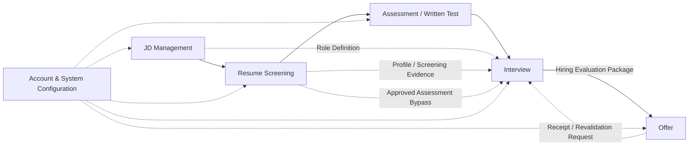
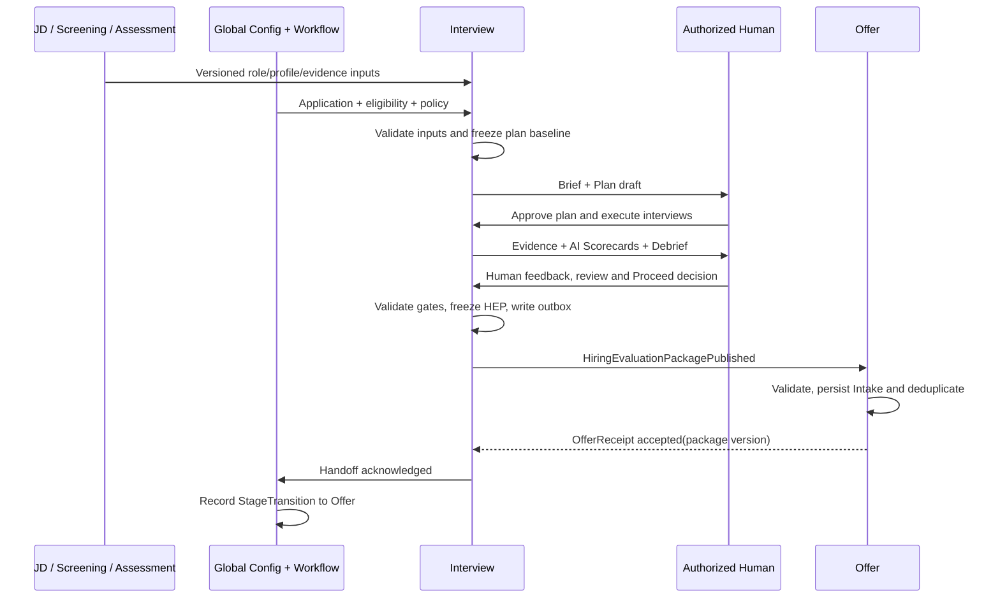

# HireOS Command — Interview Module Interface Specification

| 文档属性 | 定义 |
|---|---|
| 文档编号 | CMD-INT-002 |
| 版本 / 日期 | v1.0 / 2026-09-08 |
| 状态 | Draft for Review；拟定逻辑契约，非已部署 API 声明 |
| 配套 PRD | [CMD-INT-001 — Interview PRD v1.1](HireOS_Command_Interview_PRD_v1.1.md) |
| 权威范围 | Interview 模块边界、逻辑输入/输出对象、字段必填性、状态、集成、缺失处理与版本规则 |
| 维护责任 | Interview 产品/工程负责人；变更需相关上游、Offer 与共享平台负责人评审 |

## 1. Purpose, Authority & Conventions

本规范是 Interview 对接上下游的详细 **Source of Truth**。PRD 描述产品意图与体验，本规范定义模块间契约。两者冲突时，接口实现依据本规范并同步修订 PRD；产品范围调整仍须通过产品评审。

覆盖 v1.0/P0 的全部逻辑边界对象及其关键字段，包括用户操作、会议连接器和 Offer 回执；P1 实时流式建议不在本版线协议范围内。本文规定逻辑消息与校验行为，实际 URL、传输协议、存储和完整机器可校验 Schema 由工程实现文档承接，不得改变这里的语义。

### 1.1 字段约定

- **R — Required**：在指定接收/提交时点必须存在且有效。
- **O — Optional**：可缺省，缺省不会自动推导为通过、否定或零分。
- **C — Conditional Required**：满足表中条件时必填；不满足条件时必须有明确适用状态。
- `Ref`：`{entity_type, entity_id, version}`；实体不可变时 version 仍记录其固定版本。只接受本 Workspace 内、访问获准且可解析的引用。
- `ActorRef`：`{actor_id, actor_type: human|agent|service}`；需人工批准的字段只允许 human。
- `Reason`：`{code, explanation}`；豁免、否决、修改、失效与重试终止均需理由。
- `ArtifactRef`：`{artifact_id, version, content_hash, media_type, access_scope}`；下载地址临时签发，不持久化公共录音链接。
- 时间为 ISO 8601 UTC；预约另存 IANA 时区，展示时转换。分数必须带量尺与 Rubric 版本。
- 数组 R 表示必须提供字段；表中写 `≥1` 时必须非空。`[]` 表示已确认没有元素；数据没到齐用显式 status，不用空数组掩盖。
- `null` 仅用于有定义的未知/不适用值，并配 `data_status` 或 `evaluation_status`；不得将 Unknown 序列化为 0 分。

### 1.2 通用对象头与引用范围

所有跨模块版本化业务对象均含以下字段；后文不重复列出。

| 字段 | 类型 / 必填 | 约束 |
|---|---|---|
| object_id / object_type | string / R | 稳定 ID 与注册的逻辑类型 |
| schema_version | semver / R | 本契约首版 1.0.0，与文档版本及对象修订号分离 |
| object_version | integer / R | 从 1 递增；已发布版本不可覆盖 |
| workspace_id | string / R | 租户隔离边界 |
| source_module | enum / R | 实际生产模块，不因转发而改变 |
| owner_module | enum / R | 有权修订该事实的模块 |
| created_at / effective_at | datetime / R | 记录时间与业务生效时间 |
| created_by | ActorRef / R | 生产者身份 |
| source_refs | Ref[] / R | 派生产物须非空；原生根对象可空 |
| application_id / job_id / candidate_id | string / C | 候选人岗位相关对象全部必填；全局配置、岗位模板不要求 candidate/application |
| supersedes_ref | Ref / C | 修订旧对象时必填 |
| data_classification / purpose | string / R | 数据分类及允许处理用途，由全局策略验证 |

## 2. Global Modules & Boundaries



| 模块 | 关系 / 核心问题 | 所有权与边界 |
|---|---|---|
| Account & System Configuration | 横向全局；谁能做什么、采用哪些设置 | Workspace、Membership、Permission、Policy、模板默认值、集成配置；不拥有面试结论 |
| JD Management | 间接上游；岗位需要什么 | Job、JDVersion、RequirementGraphVersion、Requirement/Competency 标准 |
| Resume Screening | 间接上游；候选人声称什么、初筛发现什么 | Screening Package、MatchAssessment、简历 Claim 与筛选证据；Candidate 主数据由共享候选人域拥有 |
| Assessment / Written Test | 标准直接前序；测试证明了什么 | 测评状态、成绩、题目与产物、测试证据 |
| Interview | 承接前序证据，补齐和验证岗位要求 | Plan、Session、面试记录、面试 Evidence、Scorecard、Debrief、Hiring Evaluation Package |
| Offer | 直接后序；在何种获批条件下发 Offer | Offer Intake、商业审批、薪酬条款、协商、发放与结果；不改写面试证据 |
| Shared Candidate / Workflow / Evidence services | 共享逻辑能力，不是新增业务流程阶段 | Candidate/Profile、Application、StageTransition、Decision、证据注册/查询；物理存储方式不改变事实所有者 |

默认直接前序是 Assessment。只有该岗位工作流标记测评 Not Required，或存在适用且有效的人工 Waiver，Screening 才能直接交接 Interview。失败的测评如需推进，也必须显式记录越过门槛的批准理由；不得把 Fail 改为 Pass。

## 3. Entity Model & Data Ownership

| 关键实体 | 关联及基数 | 事实所有者 / Interview 权限 |
|---|---|---|
| Workspace / Membership / PolicyVersion | Workspace 1:N Membership / PolicyVersion | 全局模块；只读应用策略 |
| Job / JDVersion / RequirementGraphVersion | Job 1:N 各版本 | JD；只读锁定版本 |
| Requirement / Competency | 归属 RequirementGraphVersion；Requirement 可映射多个 Competency | JD；Interview 建评价映射，不更改标准 |
| Candidate / CandidateProfileVersion / ResumeDocument | Candidate 1:N Profile / Resume | 共享候选人域；Screening 提供受控引用 |
| Application | 一个 Candidate + 一个 Job + 一个 Workspace；Candidate/Job 各 1:N Application | 共享工作流；Interview 不直接改阶段 |
| MatchAssessment / Assessment / CriterionResult | Application 1:N Assessment，Assessment 1:N Result | 分别由 Screening / Assessment 生产并修订 |
| InterviewPlan / Round / InterviewSession | Application 1:N Plan 版本，Plan 1:N Round，Round 0:N Session | Interview；重约/补面保留历史 |
| Question / Answer / SourceSegment | Session 1:N 实际问答；Answer 1:N 片段 | Interview；保留题目快照与回答来源 |
| EvidenceItem / EvidenceLink | Evidence 与 RequirementEvaluation 为 N:N，由 Link 连接 | 来源模块拥有 Evidence；共享层注册，Interview 仅修订自产事实 |
| Scorecard / RequirementEvaluation | Session 1:N Scorecard 版本；Scorecard 1:N 逐项评估 | Interview；AI 与各人工评估者独立 |
| Debrief / EvaluationReport | Application 1:N 报告版本 | Interview；组合各轮证据，不取代源记录 |
| Decision / StageTransition | Application 1:N 决定/阶段变更 | 共享工作流；Interview 提交有权限的人工作用，保留决策者 |
| HiringEvaluationPackage | Application 1:N 包修订 | Interview；发布后不可变 |
| OfferIntake / Offer | 包可有接收记录；Application 1:N Offer 版本 | Offer；引用明确包版本 |
| AgentRun / DomainEvent / AuditLog | 记录生成、业务事件和操作历史 | 对应服务追加写入；用途分离 |

命名映射：Interface 的 InterviewSession 对应领域参考中的 Interview；Human Scorecard 对应 InterviewFeedback 的结构化版本；Competency Evaluation 落为 RequirementEvaluation；Hiring Evaluation Package 是带交接清单的聚合产物，不是新的 Candidate 主实体。

## 4. Input Object Catalogue

### 4.1 边界输入清单

| ID / 输入对象 | 来源 → 事实所有者 | R/O/C 与接收时点 | 用途 / 状态 |
|---|---|---|---|
| IN-01 ApplicationContext | 上游工作流 → Shared Workflow | R，建 Intake 时 | 绑定岗位案件；active/paused/closed 与当前阶段分离 |
| IN-02 RoleDefinitionSnapshot | JD → JD | R，生成计划前 | published JD + confirmed requirement graph |
| IN-03 CandidateProfileSnapshot | Screening → Shared Candidate | R，生成 Brief 前；Resume O | 有版本的背景及简历引用 |
| IN-04 ScreeningPackage | Screening → Screening | R，正常进入 Interview 前 | completed；例外推进须 Waiver |
| IN-05 AssessmentPackage | Assessment → Assessment | C，标准路径 R | completed；未完成/失效不得伪装 completed |
| IN-06 StageEligibilityRecord | Workflow + 授权用户 → Workflow | R，Intake 验证时 | eligible / blocked，包含前序资格和适用豁免 |
| IN-07 PreInterviewEvidenceProfile | 共享 Evidence 聚合 → 各原始来源 | R，计划前；可由已收输入计算 | available / partial；每一项保留源引用 |
| IN-08 GlobalConfigurationSnapshot | 全局模块 → 全局模块 | R，任何受控操作前 | active，权限每次操作重新检查 |
| IN-09 InterviewConfiguration | 用户 + 全局模板 → Interview | R，计划批准前 | draft / approved；排期字段在预约前必填 |
| IN-10 PreviousInterviewContext | Interview → Interview | C，同一案件后续轮次 R | 历史场次、已覆盖问题与有效证据 |
| IN-11 CaptureInput | 会议连接器或人工 → Interview 采集记录 | C，实际执行/复核时 | partial / complete / failed / not_permitted |
| IN-12 HumanReviewSubmission | 面试官/HM → Interview 或 Workflow | C，反馈/决定提交时 | draft / submitted；含评估或决定 |
| IN-13 OfferReceipt | Offer → Offer | C，包投递后 R；未到为 pending | accepted / rejected，详见 §9 |
| IN-14 ChangeNotice | 来源模块/全局模块/Offer → 各来源 | C，已使用数据变化或请求复核时 | changed / restricted / revoked / revalidation_requested |

### 4.2 IN-01 — ApplicationContext

| 字段 | 必填 | 定义 |
|---|---|---|
| application_ref / job_ref / candidate_ref | R | 三者在同一 Workspace，Application 的 Job/Candidate 不可被输入覆盖 |
| pipeline_definition_ref / stage_instance_ref | R | 工作流版本与本次面试阶段实例 |
| current_stage / process_status | R | 当前阶段与 active/paused/closed；不可混合运行故障状态 |
| hiring_manager_ref / recruiter_ref | R | 有效负责人，可创建补资料/复核任务 |
| stage_entry_decision_ref | R | 人工或获批准规则作出的入阶段依据；可引用 IN-06 |
| external_refs | O | ATS 等外部标识，只用于映射，不作内部主键 |

### 4.3 IN-02 — RoleDefinitionSnapshot

| 字段 | 必填 | 定义 |
|---|---|---|
| job_title / department / team / location / employment_type / job_level | R | 结构化岗位背景；允许明确 not_applicable，不允许无说明空值 |
| jd_version_ref / requirement_graph_version_ref | R | 精确锁定发布/确认版本，不能只引用 latest |
| responsibilities / requirements / qualifications | R | 已发布岗位文本；preferred_qualifications 为 O |
| requirements_model[] | R，≥1 | 每项含 requirement_id、competency_ids、description、must_have、required_level、weight、evaluation_criteria、evidence_standard、rubric_ref |
| competency_definitions[] | R，≥1 | competency_id、name、definition；必须覆盖 requirements_model 的全部 competency_ids |
| weight_policy | R | 非负权重及归一化规则；计分项权重总和为 1 |
| headcount_context / compensation_context | O | 经授权仅作岗位背景；不能视为 Offer 预算或薪资批准 |

### 4.4 IN-03 — CandidateProfileSnapshot

| 字段 | 必填 | 定义 |
|---|---|---|
| candidate_profile_version_ref / display_name | R | 锁定当前案件使用的候选人资料版本 |
| resume_refs | O | ResumeDocument/ArtifactRef 数组；无简历时可用获准结构化资料 |
| employment_history / education / skills / projects / certifications | O | 每条有来源与 verification_status；缺省为 unknown |
| location / experience_years | O | 背景信息，不能取代能力证据 |
| contact_ref | C | 发送预约通知时必填；保存受控引用而非在所有评估包复制联系方式 |
| profile_completeness / missing_fields | R | 明确当前可用性与缺失字段；不能用 AI 补造履历 |

### 4.5 IN-04 — ScreeningPackage

| 字段 | 必填 | 定义 |
|---|---|---|
| screening_ref / match_assessment_ref / status | R | status=completed，例外需资格记录说明 |
| input_profile_ref / input_requirement_graph_ref | R | 能够识别筛选与当前计划是否用同一版本 |
| candidate_role_match[] | R | requirement_id、match_status、score(O)、scale(C，有 score 时)、evidence_refs、confidence |
| claims[] | R | claim_id、statement、resume/source_ref、requirement_ids、verification_status；可空 |
| evidence_refs / uncertainties / contradictions | R | 数组，可空；不允许把 Claim 标记为 verified 而无依据 |
| recommendation / rationale | R | 上游建议及理由，不等于 Interview 人工决定 |
| gaps_to_verify | R | 每项 requirement_id、question_to_resolve、source_refs；可空 |

### 4.6 IN-05 — AssessmentPackage

| 字段 | 必填 | 定义 |
|---|---|---|
| assessment_ref / assessment_type / completion_status | R | not_started/in_progress/completed/failed/cancelled；failed 表示执行失败，能力未通过用 outcome=fail |
| completed_at / outcome | C | completed 时 R；outcome=pass/fail/inconclusive/not_scored |
| overall_score / score_scale / pass_threshold | C | 采用计分测评时前两项 R；采用门槛时 threshold R |
| percentile / time_used_seconds | O | 百分位须带 comparison_population_ref，避免跨样本误比 |
| skill_results[] | R | 每项 competency_id、evaluation_status、score(C)、scale(C)、evidence_refs、confidence |
| question_results[] | R | 每项 question_ref、answer_artifact_ref、evaluation、competency_ids、evidence_refs；受限内容使用受控引用 |
| strengths / weaknesses / risk_signals / unverified_competencies | R | 各项带来源；风险标记不自动成为能力低分 |
| interview_recommendation / rationale | R | 后续应验证的目标和理由 |
| access_limitations | R | 列出题目/答案受限部分；空数组表示无额外限制 |

completed 不代表 pass。存在多个测试时传全部相关 AssessmentPackage 引用，并以 IN-06 记录哪些必需测试已完成、豁免或阻塞。零测评时传豁免/不适用记录，不制造空测评包。

### 4.7 IN-06 — StageEligibilityRecord

| 字段 | 必填 | 定义 |
|---|---|---|
| eligibility / evaluated_at / workflow_policy_ref | R | eligible/blocked，计算时间与流程规则版本 |
| predecessor_statuses[] | R，≥1 | stage、status、result_refs；Screening 与 Assessment 路径均须说明 |
| assessment_disposition | R | required_completed / not_required / waived / blocked |
| waivers[] | C | 越过必需阶段、失败门槛或缺失要求时 R；每项 waiver_id、scope、reason、approved_by(human)、approved_at、expires_at(C，有期限时)、policy_ref |
| blocker_codes | R | eligible 时空，blocked 时非空 |

not_required 必须由工作流版本证明；waived 必须由有权限的人批准。豁免仅作用于明确 scope，不赋予数据访问权限，不修改原成绩。

### 4.8 IN-07 — PreInterviewEvidenceProfile

`as_of`(R)、`input_refs`(R)、`availability`(R: available/partial)、`coverage[]`(R，覆盖全部必测要求)。每项 coverage 包含 `requirement_id`、`competency_ids`、`evidence_refs`、`supporting_refs`、`contradicting_refs`、`evidence_strength`、`confidence`、`verification_status`、`unresolved_questions`、`freshness_status`，全部 R，可为空证据数组并标记 unknown。

它是可重建读模型，继承 JD、Screening、Assessment 与历史面试的引用；不得变成丢失来源的第二份真相。上游材料少时仍可构建 partial 视图，但不能绕过 IN-01/02/04/06 的进入条件。

### 4.9 IN-08 / IN-09 — Configuration

| 对象 | 字段 | 必填 / 规则 |
|---|---|---|
| Global | config_version_ref、workspace_ref、policy_refs、role_permission_refs | R；记录快照，每次访问重新检查当前权限 |
| Global | workflow_template_ref、rubric_template_refs、language_defaults、timezone_default | R；面试实例的显式选择可覆盖获准默认项 |
| Global | recording_policy_ref、data_access_policy_ref、retention_policy_ref、ai_processing_policy_ref | R；配置缺失时禁止依赖的采集/AI 操作 |
| Global | integration_connection_refs | C；使用日历/会议/通知服务时 R，不传密钥 |
| Interview | plan_owner_ref、rounds[]、language、timezone、rubric_ref、configuration_status | R；rounds ≥1，每轮含 round_id、type、duration_minutes、target_requirement_ids、required_feedback_roles |
| Interview | mandatory_questions、question_bank_refs | O；选定必问题后批准版本中不可无痕删除 |
| Interview | interviewer_refs / panel_refs | C；预约前至少一个有效面试官 |
| Interview | scheduled_start、scheduled_end、meeting_provider、meeting_ref | C；预约成功的场次 R；纯线下用 location_ref 替代 meeting_ref |
| Interview | capture_mode、processing_permission_refs | R；mode=record_and_transcribe/transcribe_only/manual；权限须适配实际操作 |
| Interview | participant_recording_permission_refs | C；录制前按全局策略收齐，禁止用管理员默认设置代替参与者许可 |

### 4.10 IN-10 / IN-11 / IN-12 — History, Capture & Human Actions

- **PreviousInterviewContext**：`session_refs`、`asked_question_refs`、`evidence_refs`、`scorecard_refs`、`open_gaps`、`access_filtered_fields` 均 R；后续轮次有历史但无权限时标记 restricted，不伪装为不存在。独立评分前按权限隐藏同伴评分。
- **CaptureInput**：`session_ref`、`capture_id`、`capture_type`(audio/video/transcript/manual_notes/answer)、`captured_at`、`source_actor_or_provider`、`capture_status`、`permission_refs`、`sequence_no` 均 R；有效内容时 `artifact_ref` 或 `structured_content` 至少其一 R。转写片段含 segment_id、speaker_ref、start/end offset、text、quality_flag；人工问答含 question_ref、answer_text、note_author，不可伪造时间戳。
- **HumanReviewSubmission**：`submission_id`、`submission_type`(scorecard/debrief_review/stage_decision/waiver)、`subject_ref`、`expected_version`、`reviewer_ref`、`submitted_at`、`payload` 均 R；Scorecard payload 遵循 OUT-04，决定遵循 OUT-07，Waiver 遵循 IN-06。改已提交结论时 `reason` 和 `supersedes_ref` 必填。
- **ChangeNotice**：`notice_id`、`notice_type`、`affected_refs`、`reason`、`effective_at`、`producer_ref` 均 R；替换时 `replacement_refs` 为 C；Offer 请求复核须提供 `package_ref`、`requested_information`、`requester_ref`。无权请求的额外原始数据不予披露。

## 5. Output Object Catalogue

| ID / 输出 | 接收方 | 必填时点 / 所有者 | 主要状态 |
|---|---|---|---|
| OUT-01 InterviewPlan & Brief | Recruiter、HM、面试官 | 批准前 R / Interview | draft/approved/superseded/cancelled |
| OUT-02 InterviewRecord | Review、获授权证据处理服务 | 场次结束 R / Interview | planned/scheduled/in_progress/completed/interrupted/no_show/cancelled |
| OUT-03 InterviewEvidencePackage | 共享证据层、后续轮次 | Review 时 R；证据可空但标缺口 / Interview | draft/reviewed/published/superseded/restricted |
| OUT-04 Scorecard & CompetencyEvaluation | 面试官、HM、Debrief | 所需反馈提交时 R / Interview | draft/submitted/superseded |
| OUT-05 CrossRoundEvaluation & Debrief | HM、Committee | 阶段决定前 R / Interview | draft/reviewed/superseded |
| OUT-06 HiringEvaluationPackage | **Offer Module** | **Proceed 交接时 R / Interview** | draft/in_review/ready/published/superseded/revoked |
| OUT-07 InterviewStageDecision | 共享 Workflow、审计、包生成器 | 决策提交时 R / Shared Workflow | recorded/superseded |
| OUT-08 WorkflowTask / DomainEvent / AuditRecord | 工作流、通知、审计 | 相应动作发生时 R / 各权威服务 | 按事件、任务生命周期 |
| OUT-09 SchedulingRequest | 日历/会议/通知连接器 | 安排/改期/取消时 C / Interview | requested/succeeded/failed |

### 5.1 OUT-01 — InterviewPlan & Brief

R 字段：`plan_id`、`input_refs`、`evidence_cutoff_at`、`objectives`、`rounds`、`competency_coverage_map`、`open_gaps`、`status`、`brief`。Brief 包含背景摘要、已支持能力、待验证 Claim、矛盾、Unknown、推荐重点及各条 `source_refs`。

每个 Round：`round_id`、`type`、`duration_minutes`、`target_requirement_ids`、`owner_ref`、`questions[]` 均 R。每个 Question：`question_id`、`text`、`requirement_ids`、`competency_ids`、`evaluation_goal`、`expected_signals`、`risk_signals_to_verify`、`follow_up_guidance`、`mandatory` 均 R。approved 时 `approved_by` 和 `approved_at` 为 R。后续编辑形成新版本，不更改历史实际提问。

### 5.2 OUT-02 — InterviewRecord

R 字段：`session_id`、`plan_ref`、`round_id`、`participant_refs`、`session_status`、`questions_and_answers`、`capture_status`、`permission_refs`、`record_completeness`。每个实际问答包含 question snapshot/ref、answer/source segment refs；未回答须标记 unanswered。

C 字段：实际开始/结束的场次必须有 `started_at/ended_at`；completed 必须有 `duration_seconds`；interrupted/no_show/cancelled 必须有 `reason` 与 `recorded_by`。O 字段：`recording_refs`、`transcript_ref`、`interviewer_notes_refs`；有录音不表示 Offer 可读取。即便完全缺席也输出状态记录，不生成虚假问答。

### 5.3 OUT-03 — InterviewEvidencePackage

包级 R：`session_refs`、`evidence_items[]`、`evidence_links[]`、`missing_evidence[]`、`review_status`、`input_refs`。每条 EvidenceItem：

| 字段 | 必填 | 定义 |
|---|---|---|
| evidence_id / statement / source_module | R | 稳定标识、描述、原始来源 |
| source_ref / source_locator | R | 原材料引用与 segment、问答、页码或手工记录 ID 等可定位位置 |
| evidence_type | R | self_reported / demonstrated / assessment_artifact / externally_verified / interviewer_observation |
| verification_status | R | unverified / reviewed / verified / disputed；reviewed 仅表示核对抽取内容，不代表经历真实 |
| strength / confidence | R | strong/medium/weak/unverified；high/medium/low/unknown |
| created_by / reviewed_by | R / C | 若人工已复核，reviewed_by 必填 |
| valid_at / expires_at | R / O | 有效时点及适用的失效时间 |
| access_scope / limitation_reason | R / C | 受限时必须说明可披露范围和原因 |

每个 EvidenceLink 必含 `link_id`、`evidence_ref`、`requirement_id`、`competency_ids`、`evaluation_ref`、`stance`(supports/contradicts/insufficient/unknown)、`strength`、`confidence`、`rationale`。一个证据可关联多个要求；聚合时按 evidence_id + version 去重，不能把重复引用计为独立支持。

### 5.4 OUT-04 — Scorecard & CompetencyEvaluation

R 字段：`scorecard_id`、`session_ref`、`evaluator_ref`、`evaluator_type`(ai/human)、`rubric_ref`、`requirement_graph_ref`、`evaluations[]`、`recommendation`、`status`、`input_refs`。

每个 evaluation 必含 `requirement_id`、`competency_ids`、`evaluation_status`(evaluated/unknown/not_applicable)、`score`、`evidence_refs`、`rationale`、`confidence`、`must_have_result`(meets/below/unknown/not_applicable)。evaluated 时 score 为 1–5 且 evidence_refs ≥1；unknown/not_applicable 时 score=null，并说明原因。权重继承岗位版本，不允许评估者自行调整。

AI 记录 `agent_run_ref`；人工提交记录 `submitted_at`。人工接受 AI 草稿也须生成独立 human Scorecard 并保留来源；修改须记录 `override_reason`。AI Recommendation 使用 Strong Hire / Hire / Borderline / No Hire / Strong No Hire / Insufficient Evidence，绝不直接触发拒绝或录用。

### 5.5 OUT-05 — CrossRoundEvaluation & Debrief

R 字段：`debrief_id`、`included_session_refs`、`scorecard_refs`、`requirement_evaluations`、`coverage`、`strengths`、`weaknesses`、`risk_signals`、`disagreements`、`missing_evidence`、`recommended_next_actions`、`ai_recommendation`、`input_refs`、`status`。

- `coverage` 包含总要求数、已评估数、Must-have 总数/有有效证据数、已评估权重；分母为 0 时比率 null 并标 N/A。
- `disagreements[]` 包含 requirement_id、各评价引用、分歧说明、resolution_status、resolution_reason(C，已解决时)、reviewer_ref(C)。不能以简单平均隐藏相反证据。
- 默认只有全部计分项完成时生成 `weighted_score`；否则该值 null，显示 partial evaluation 与已评估权重。
- reviewed 时 `reviewed_by`、`reviewed_at` 为 R；保留必须轮次、反馈未完成清单，不能只汇总已完成部分冒充最终结果。

### 5.6 OUT-07 / OUT-08 / OUT-09 — Decisions, Tasks & Scheduling

**InterviewStageDecision** 必含 `decision_id`、`decision_scope=interview_stage`、`decision_maker`(human)、`result`(proceed/hold/reject/request_more_evidence)、`reason`、`evidence_refs`、`debrief_ref`、`made_at`、`policy_ref`。改变结论时新增 Decision 并引用 supersedes；工作流由此创建 StageTransition，而非 Interview 直接修改 Application.current_stage。

**WorkflowTask** 必含 task_id、application_id、task_type、owner_ref、status、reason、subject_refs、completion_definition；due_at 可选；完成时 result_ref 必填。类型包含 missing_data、scorecard_review、additional_interview、handoff_failure、revalidation。

**DomainEvent** 遵循 §8 的信封；**AuditRecord** 必含 audit_id、actor、action、subject_ref、occurred_at、result、request_id，对访问、导出、授权、评分修改、发布、撤回留痕。

**SchedulingRequest** 必含 request_id、idempotency_key、operation(create/reschedule/cancel)、session_ref、participant_refs、timezone、requested_by、expected_session_version；create/reschedule 时 start/end 和 meeting_mode 必填；cancel 时 reason 必填。连接器结果作为 IN-11 CaptureInput 的结构化服务回执进入，capture_type 扩展为 `scheduling_receipt`，含 request_id、result、meeting_ref(C，成功线上预约时)、delivery_status、error(C，失败时)。通知失败不自动取消已成功的会议，单独建补发任务。

## 6. Hiring Evaluation Package — Core Output to Offer

**Hiring Evaluation Package（HEP）是 Interview 向 Offer Module 交付的核心、版本化输出。** Offer 必须引用具体 `package_id + object_version`，不能只接收一句“Hire”或一张未标版本的汇总分数。

### 6.1 包字段契约

除 §1 通用头外，以下字段适用：

| 字段 | 类型 / 必填 | 定义 |
|---|---|---|
| package_id | string / R | 同一评估包系列的稳定 ID |
| package_status | enum / R | draft/in_review/ready/published/superseded/revoked |
| application_ref / candidate_profile_ref / job_ref | Ref / R | 同一案件，明确候选人和岗位版本 |
| jd_version_ref / requirement_graph_ref / rubric_ref | Ref / R | 冻结评价基准 |
| input_manifest | Ref[] / R，≥1 | 全部使用的 Screening、Assessment、Interview、Scorecard、Evidence 输入及版本 |
| eligibility_ref / waiver_refs | Ref / R；Ref[] / R | 进入及推进资格，豁免数组可空 |
| interview_summary | object / R | 必需轮次、已完成/取消/豁免轮次、session_refs、完成与反馈覆盖 |
| competency_evaluations | object[] / R，≥1 | 每个要求的逐项结果、权重、分数/Unknown、证据、置信度，沿用 OUT-04 |
| evidence_manifest | object[] / R | evidence_ref、来源模块、source_locator、stance、access_scope、有效性；可为空仅限被显式豁免的证据缺失场景 |
| strengths / weaknesses | object[] / R | 每项说明、要求映射、来源引用；可空 |
| risks / missing_evidence / disagreements | object[] / R | 影响、状态、相关要求、责任人、处理/豁免引用；可空但不可省略字段 |
| coverage / weighted_score | object / R；number或null / R | 沿用 OUT-05，不能将部分总分冒充完整评分 |
| ai_recommendation | object / R | result、rationale、confidence、evidence_refs、agent_run_ref；AI 不可用时 result=unavailable 并有 reason |
| human_review | object / R | reviewed_by、reviewed_at、reviewed_debrief_ref、review_outcome；必须为 authorized human |
| interview_stage_decision_ref | Ref / R | 指向有效 proceed 决定；其他结果保存在 Interview，不启动 Offer |
| recommended_next_action | enum / R | 本版交给 Offer 的值为 offer_review；不表示 issue_offer |
| handoff_limitations | object[] / R | 未满足项、批准的豁免及应由 Offer 处理的问题，可空 |
| evidence_cutoff_at / published_at | datetime / R、C | 证据截点必填；published 时发布时间必填 |
| validity | object / R | valid_as_of、freshness_status、revalidation_triggers、expires_at(O) |
| disclosure_policy_ref | Ref / R | 下游字段、原始资料访问与使用限制 |
| content_hash | string / R，发布时 | 发布快照的确定性规范化摘要，工程需固定计算规则 |
| agent_run_refs / audit_refs | Ref[] / R | 可追溯生成和人工审核，纯人工路径 agent_run_refs 可空 |

包包含必要结构化摘要与受控引用，默认不内嵌整份录音、完整转写、内部原始笔记或多余联系信息。Offer 若确需读取证据，须在读取时再次授权。禁止发送后形成永久绕过权限的副本。

### 6.2 Ready / Publish Gate

同时满足以下条件才能从 in_review 进入 ready 并发布：

1. Workspace、Application、Job、Candidate 与全部引用一致，Schema 与对象版本有效。
2. 岗位基准已发布/确认；参与评估的快照可解析，所有失效变更已复核。
3. 所有必需场次、反馈和评审已完成，或具有明确 scope 的有效人工豁免。
4. 每个 Must-have 有明确 meets/below/unknown；below 或 unknown 默认阻止交接。仅当工作流允许、获授权人批准且在 handoff_limitations 显示时，才允许例外交给 Offer 复核。
5. Debrief 已人工复核，影响结论的分歧有解决记录或获准保留的风险；AI 故障不得伪造推荐，可走有理由的纯人工评估路径。
6. 人工 InterviewStageDecision=proceed 且有效；同一案件无较新的 hold/reject/withdrawn 或关闭状态。
7. 向 Offer 的数据使用权限有效；权限和租户隔离不能豁免。
8. 发布者有发布权限；发布记录、内容摘要与 outbox 消息可靠持久化。

“评估完整”与“获准例外推进”是两个不同标签；获准豁免不提升证据覆盖率，也不隐藏风险。

### 6.3 示意数据（字段节选，非完整 payload）

```json
{
  "package_id": "hep_example_01",
  "object_version": 1,
  "schema_version": "1.0.0",
  "workspace_id": "ws_example",
  "application_id": "app_example",
  "job_id": "job_example",
  "candidate_id": "candidate_example",
  "package_status": "published",
  "recommended_next_action": "offer_review",
  "interview_stage_decision_ref": {
    "entity_type": "Decision", "entity_id": "decision_proceed_example", "version": 1
  },
  "ai_recommendation": {
    "result": "Hire",
    "rationale": "岗位要求已有可追溯支持证据，等待 Offer 商业审批。",
    "confidence": "medium",
    "evidence_refs": [{"entity_type": "EvidenceItem", "entity_id": "ev_example", "version": 1}],
    "agent_run_ref": {"entity_type": "AgentRun", "entity_id": "run_example", "version": 1}
  },
  "missing_evidence": [],
  "waiver_refs": [],
  "handoff_limitations": []
}
```

## 7. State Models & Transition Guards

### 7.1 生命周期分离

| 对象 | 状态流 | 转换条件 |
|---|---|---|
| Intake | received → validating → accepted / blocked | 缺失修复后 blocked→validating；accepted 才进入计划 |
| Plan | draft → approved → superseded / cancelled | 人工确认；修改已批准计划产生新 draft |
| Session | planned → scheduled → in_progress → completed / interrupted | scheduled 也可 no_show/cancelled；已取消或缺席场次重约新 Session，引用旧场次 |
| Scorecard | draft → submitted → superseded | 人工提交校验；修订产生新版本，不恢复旧版 draft |
| Debrief | draft → reviewed → superseded | 所需评审与分歧处理完成 |
| HEP | draft → in_review → ready → published → superseded / revoked | §6.2；review 不通过退 draft；已发布版本不原地修改 |
| Delivery | pending → sending → acknowledged / retryable_failed / rejected | retryable_failed→sending；接收拒绝需按错误修复 |
| AI Run | requested → running → succeeded / failed / cancelled | 重试创建新 run 并引用 retry_of，不把场次状态改为 failed |

对象的 freshness_status（current/stale/revalidation_required）和 access_status（available/restricted/revoked）独立于生命周期。已完成面试不会因 AI 失败变成“未完成”，但评估和发布仍可被阻塞。

### 7.2 人工结果与流程

| 决定 | Workflow 行为 | Offer 行为 |
|---|---|---|
| proceed | 包发布后保持交接等待；Offer ACK 后写 StageTransition 至 Offer | 接收并建/更新 Intake；另行商业审批 |
| hold | 保留 Interview 等待原因、负责人及复核任务 | 不启动新 Offer |
| request_more_evidence | 创建补面/补资料任务，必要时新计划版本 | 不启动新 Offer |
| reject | 记录人工决定与终局流程变更 | 不启动新 Offer；如已有接收包则通知失效并复核 |
| candidate withdrawn / application closed | 共享工作流记录事实，取消未执行任务并通知下游 | 未执行 Offer 动作暂停，处理由 Offer 负责 |

## 8. Data Flow & Integration Rules

### 8.1 标准数据流



### 8.2 事件信封

每个跨模块事件必含 `event_id`、`event_type`、`event_schema_version`、`producer`、`workspace_id`、`aggregate_id`、`aggregate_version`、`occurred_at`、`recorded_at`、`correlation_id`、`idempotency_key`、`payload_ref` 或 `payload`；被其他事件触发时 `causation_id` 必填。候选人案件事件还必须含 application_id、job_id、candidate_id。事件只携带所需数据，不传集成密钥或公开原始资料地址。

| 事件 | 生产 → 消费 | 触发 / 最小业务载荷 |
|---|---|---|
| InterviewIntakeRequested | Workflow → Interview | 入阶段请求，IN-01～09 引用清单及 eligibility_ref |
| InterviewPlanApproved | Interview → Workflow | 批准，plan_ref、approver_ref |
| InterviewScheduled / Completed | Interview → Workflow | 场次事实，session_ref、状态与实际时间 |
| InterviewEvidencePublished | Interview → Evidence / Workflow | 复核证据可用，evidence_package_ref |
| InterviewStageDecisionRecorded | Workflow → Interview | 有效人工决定，decision_ref、result |
| HiringEvaluationPackagePublished | Interview → Offer | package_ref、content_hash、decision_ref |
| HiringEvaluationPackageAcknowledged | Offer → Interview / Workflow | receipt_ref、package_ref、offer_intake_ref |
| HiringEvaluationPackageRejected | Offer → Interview | receipt_ref、package_ref、error、retryable |
| SourceVersionChanged / DataAccessRevoked | 来源/全局 → 已登记消费者 | affected_refs、replacement_refs(C)、reason |
| HiringEvaluationPackageInvalidated | Interview → Offer / Workflow | package_ref、reason、replacement_ref(C)、required_action |
| InterviewRevalidationRequested | Offer → Interview | package_ref、requested_information、requester_ref |

### 8.3 Integration Rules

1. **单一事实所有者**：消费方不写上游 Job、Profile、Assessment 或 Evidence；纠错请求发回所有者。共享聚合视图可以重建。
2. **版本冻结**：Plan 批准时冻结基准；每次评估与交接保留输入清单和证据截点。上游新版本触发影响检查，不静默换成 latest。
3. **幂等**：消费者以 workspace_id + producer + idempotency_key 去重；包接收另以 package_id + object_version 去重。同键不同内容摘要为冲突，拒绝并报警。
4. **投递语义**：至少一次投递，发布事实与 outbox 原子保存；消费者持久化处理结果和去重记录后才能 ACK。
5. **顺序与并发**：按 aggregate_version 防止旧数据覆盖；发现缺序可暂停该聚合并补取快照。更新使用 expected_version，冲突返回当前版本，由用户/服务重新合并。
6. **建议重试默认值**：可重试错误按 1 分钟、5 分钟、15 分钟、1 小时、4 小时重试，随后进入人工处理队列；全局配置可调整。每次尝试有 attempt_id，不改变业务幂等键。
7. **权限**：接收、读取原文、AI 处理、发布和 Offer 消费均各自校验；豁免不绕过权限。缓存必须遵循撤回和访问策略。
8. **可追溯**：AI 产物含 AgentRun 与输入版本；人工修改追加版本和理由。没有原始定位的事实只能标为未验证，不作为已证实依据。
9. **评分兼容**：原始量尺保留；测评分数不可直接与 1–5 面试分数平均。需比较时记录批准的转换规则版本，并显示原分。
10. **聚合去重**：Evidence ID+version 去重，保留支持与反证；独立来源数量与引用次数分开计算。
11. **数据最小化**：Offer 只接收其工作需要的数据；共享历史按 Application、岗位权限与用途过滤，不因同一 Candidate 自动共享所有岗位记录。
12. **最终决定边界**：AI 只能产出建议；Interview 人工 Proceed 只允许进入 Offer Review。Offer 自身仍检查预算、Headcount、条款、批准及候选人状态。

## 9. Offer Receipt & Revalidation

### 9.1 IN-13 — OfferReceipt

R 字段：`receipt_id`、`package_ref`、`received_content_hash`、`status`(accepted/rejected)、`processed_at`、`consumer_schema_version`、`idempotency_key`。accepted 时 `offer_intake_ref` 必填；rejected 时 `error_code`、`error_message`、`retryable` 必填；需要修改字段时 `field_errors[]` 必填。沿用 §1 头与相同案件 ID。

Offer 必须验证：已发布且未失效的包、支持的 schema、摘要一致、案件身份、权限、有效人工 Proceed、全部 §6.2 门槛及已披露豁免。重复同版同内容返回既有 receipt，不重复创建 Offer Intake；旧版到达已接收新版之后返回 `STALE_PACKAGE_VERSION`，不得回滚。

accepted 表示 **成功接收并持久化待评审材料**，不表示 Offer 获批。ACK 丢失时 Interview 重试，Offer 返回原回执；无 ACK 时 UI 显示 Awaiting Offer Receipt，不提前标交接成功。

### 9.2 发布后的变化

- **非实质变更**（展示文字纠错且不改含义）：创建新版本，仍须确认影响；不覆盖旧版。是否需重新批准由明确规则决定。
- **实质变更**（要求、成绩、证据、评分、决定变化）：受影响包标记 revalidation_required，发送 Invalidated；重新人工复核后发布新包版本，旧版 superseded。
- **访问撤回或资料删除**：立即限制受影响资料访问并传播；必要时将包 revoked。既有审计按全局策略保留受限记录，不能维持可识别原文的无限制访问。
- **Offer 已开始审批**：Offer 将当前审核标记需重审，未执行的发放动作暂停；新版本不能自动恢复批准。
- **Offer 已发放**：不得由 Interview 自动撤回 Offer；创建 Offer 负责人复核任务，记录包变化及潜在影响。
- **Offer 要求补充证据**：产生 Revalidation Request，由 Interview 创建任务/补面；Offer 不能直接修订面试分数。

## 10. Missing Data & Error Handling

| 缺失 / 异常 | 行为 | 恢复责任 / 错误码 |
|---|---|---|
| Workspace 或案件身份缺失/不匹配 | 拒收，不保存为其他案件，不重试原内容 | 生产者 / IDENTITY_MISMATCH |
| 无有效 Job/JD/Requirement/Rubric 版本 | Intake blocked；禁止批准计划及评分 | JD / MISSING_ROLE_BASELINE |
| Candidate 结构化背景不完整 | 显示 Unknown；可规划但明确数据缺口 | Recruiter / PROFILE_PARTIAL |
| 无 Resume 但有有效 Profile | 允许；不得声称有简历证据 | Screening / 无阻塞错误 |
| Screening 未完成/缺失 | 默认阻止进入；只接受策略许可且明确批准的 Waiver | Screening/Workflow / SCREENING_NOT_READY |
| 必需 Assessment 缺失或未完成 | blocked；禁止默认视作 Pass | Assessment / ASSESSMENT_NOT_READY |
| 测评不适用 / 被豁免 | 允许适用路径，保留 disposition、批准及缺口 | Workflow / 无阻塞错误 |
| 测评完成但 outcome=fail | 保留 fail；依门槛阻塞或经明确豁免推进 | Workflow/HM / ASSESSMENT_GATE_FAILED |
| 题目级证据受限或不可取 | 标记 restricted/partial；不能以总分替代不存在的证据，必要时补证 | Assessment/权限负责人 / EVIDENCE_UNAVAILABLE |
| 上游已版本化但映射不一致 | 标 stale，要求映射与复核，禁止静默使用旧标准交接 | JD/Interview / BASELINE_MISMATCH |
| 配置或操作权限缺失 | 禁止相应操作；不使用开放默认值 | 全局模块 / POLICY_UNAVAILABLE 或 ACCESS_DENIED |
| 录制许可缺失/被拒 | 禁止录制；策略允许时转手工方式；否则改期 | Recruiter / CAPTURE_NOT_PERMITTED |
| 音频/转写失败或质量低 | 保留场次事实，提示人工记录/校对，不补造原话 | Interviewer / CAPTURE_PARTIAL |
| AI 生成失败 | 重试独立 Run，支持人工评分和理由；未生成内容标 unavailable | Interview / AI_GENERATION_FAILED |
| 缺必需 Scorecard 或关键证据 | 默认阻止 ready；补反馈/补面，例外按 §6.2 | Interview/HM / REQUIRED_REVIEW_MISSING |
| Evidence 有矛盾 | 标 disputed，保留双向来源并建复核任务 | HM / EVIDENCE_CONFLICT |
| 发布缺有效人工 Proceed | 拒绝发布至 Offer，不根据 AI 建议补决定 | HM / HUMAN_DECISION_REQUIRED |
| Offer 无响应 / 临时不可用 | pending/可重试，不推进阶段，耗尽重试后任务 | 集成负责人 / DOWNSTREAM_UNAVAILABLE |
| Offer Schema 不兼容 | rejected；升级/适配后重新投递，不无限重试 | 双方工程 / UNSUPPORTED_SCHEMA |
| 同键内容不同 / 旧版本覆盖 | 拒绝，保留既有版本，排查生产者 | 生产者 / IDEMPOTENCY_CONFLICT、STALE_PACKAGE_VERSION |
| 已关闭/撤回案件 | 停止新增交接，通知 Offer 复核既有材料 | Workflow / APPLICATION_NOT_ACTIVE |

所有错误包含 `code`、`message`、`retryable`、`field_paths`、`correlation_id`、`responsible_module`、`suggested_action`。缺失字段不由生成式 AI 猜填。已授权豁免不删除原错误历史或原始未知状态。

## 11. Versioning & Change Management

### 11.1 三种版本

| 版本 | 示例 | 用途 |
|---|---|---|
| 文档版本 | Spec v1.0 / PRD v1.1 | 人类评审与引用 |
| Schema 版本 | 1.0.0 | 跨模块结构兼容 |
| 对象版本 | package object_version=2 | 同一对象的内容修订；精确引用 |

Schema major：移除字段、更改语义/类型、将可选改必填或改变状态机导致旧消费者不兼容。minor：新增可选字段或明确可忽略扩展；枚举增加只有消费者支持 unknown 分支时才可 minor，否则 major。patch：不改变结构或语义的说明/校验错误修正。

### 11.2 兼容与迁移

1. 发布前记录生产者与消费者支持的 Schema 范围，以契约样例验证；不兼容消费者不得被强制接收。
2. 新 major 采用适配或并行支持窗口；窗口长度由相关模块评审确认，不能提前移除旧版本。
3. 快照与事件携带确切 schema_version；未知必需语义拒收，未知可选字段可忽略但不可据此改变决定。
4. 已发布 HEP、提交的 Scorecard、人工 Decision 和原始事件追加修订；通过 supersedes_ref 与失效通知更新，禁止原地改写历史。
5. 模型、提示模板、Rubric 与输入版本变化单独记录。换模型不自动覆写历史分数；重新计算产出新 draft，经人工复核后才能发布。
6. 修订需记录变更原因、影响对象、迁移方案、兼容验证和下游确认；同步更新 PRD Section 3 的边界摘要。

## 12. Contract Acceptance Scenarios

| 编号 | 输入场景 | 必须可验证的结果 |
|---|---|---|
| CT-01 | 标准 JD→Screening→Assessment→Interview | 输入绑定同一 Application，HEP 的 input_manifest 可回溯全部证据版本 |
| CT-02 | Assessment 不适用或人工豁免 | eligibility_ref 有依据；包保留缺口，不产生虚构分数 |
| CT-03 | 同 Candidate 不同 Job | 两套计划、评分与权限隔离，错配引用被拒 |
| CT-04 | 录制拒绝后手工面试 | 无录制产物，笔记真实定位，capture_mode=manual |
| CT-05 | AI 建议 Hire、人工 Hold | 不发布 Offer 包，不创建 Offer Intake |
| CT-06 | 未验证 Must-have | score=null/unknown；默认阻止交接；合法豁免明确披露 |
| CT-07 | 两个面试官意见相反 | 各意见与证据均保留，Debrief 记录解决或风险接受 |
| CT-08 | HEP 重复投递、ACK 丢失 | 同一包版本只建一次 Intake，重复返回原 receipt |
| CT-09 | v2 已接收后 v1 到达 | v1 被判旧版，不回滚，不重复推进阶段 |
| CT-10 | 源证据更新/撤回 | 受影响包可定位，发送失效事件，Offer 暂停未执行动作并复核 |
| CT-11 | Offer Schema 拒收 | 明确 rejected 与不可重试原因，建立修复任务 |
| CT-12 | Offer 已发放后面试结论修订 | 创建人工复核任务，Interview 不直接撤回 Offer |
| CT-13 | AI 失败但人工评估完整 | 允许符合门槛的人工路径，AI 标 unavailable，无伪造 AgentRun 或推荐 |
| CT-14 | 同幂等键不同摘要 | 拒绝冲突，原数据保持一致，审计可查 |

## 13. References, Review Items & Change Log

- [Interview PRD v1.1](HireOS_Command_Interview_PRD_v1.1.md)：产品目标、用户体验与优先级。
- [Command Entity Architecture ER v1.0](Hiring_OS_Command_Entity_Architecture_ER_v1.0.md)：共享领域模型参考。
- [原讨论：AI Native雇主面试模块PRD](chatgpt-conversation://6a9f7338-2b84-83e9-9f0a-49cfcb048986)：面试模块与上下游产品定义。

上线前需确认：各来源模块的 Schema 对应关系；共享候选人/证据/工作流责任团队；豁免权限矩阵；各面试模式许可政策；Rubric 行为标准；事件传输及摘要算法；兼容支持窗口与运行指标。这些是实现评审待定项，不改变本规范中的核心交接产物、事实所有权与人工决定边界。

| 版本 | 变更 |
|---|---|
| v1.0 | 首次独立接口规范；定义横向全局配置、五阶段链路、输入输出对象、HEP、Offer ACK、状态、异常、幂等、版本与验收 |
