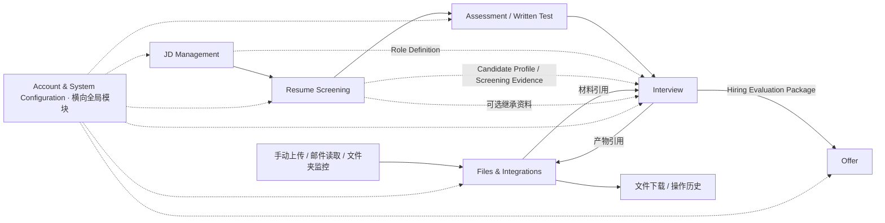
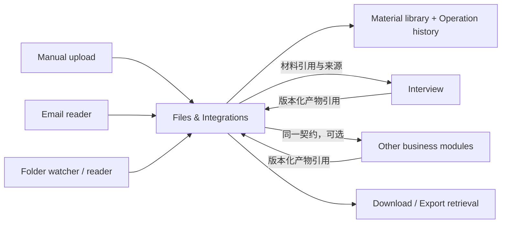

# HireOS Command — AI-Native Employer Interview PRD

| 文档属性 | 定义 |
|---|---|
| 文档编号 | CMD-INT-001 |
| 版本 | v1.5 |
| 日期 | 2026-09-08 |
| 状态 | Draft for Review；产品定义，尚未表示已实现或已批准上线 |
| 产品 / 模块 | HireOS Command / Employer Interview |
| 产品定位 | AI-Native Interview Execution & Evaluation Engine |
| 详细接口 Source of Truth | [CMD-INT-002 — Interview Module Interface Specification v1.0](HireOS_Command_Interview_Interface_Spec_v1.0.md) |
| 读者 | Product、Design、Engineering、AI、QA、Recruiting Operations |

本版在 v1.4 基础上标识跨模块公共能力：主题/字号、文件上传下载、邮件监控读取、文件夹监控读取、操作历史及基础权限等。**当前先在各模块 PRD 中保留需求和使用场景；未来整合全部模块时再统一抽象公共能力。** 本次只更新 Interview PRD 的归属标记与边界说明，不表示其他模块文档或公共服务已完成改造。

**版本优先级：本 PRD v1.5 是当前产品需求基线。** Interface Spec v1.0 与 Prototype Design Brief v1.0 保留作背景；若其输入通道归属、独立模式输入门槛、单人批准、浅色单主题或首页规则与本版冲突，以本版为准。旧接口规范仍需后续同步，本次不宣称已经更新。用户已确认功能方向；本文新增统计精确口径、默认配色/字号值和刷新时机为可执行的产品默认方案。

| 本版重点 | 位置 |
|---|---|
| 公共能力清单、标记规则及未来统一抽取方式 | Section 3.8；相关功能章节就地备注 |
| Google Drive 文件体验参考与范围 | Section 8.7.10 |
| v1.0–v1.4 累计变更历史、影响与维护规则 | Section 14.2–14.3 |
| 独立上传/下载、邮件读取、文件夹监控、历史与状态 | Section 8.7 |
| 个人与全局统计、优先级、折叠、口径 | Section 8.2 |
| Light / Dark / Deep / System 与配色 | Section 8.3 |
| Small / Medium / Large 字号与可访问性 | Section 8.4 |
| 偏好存储、状态和原型要求 | Section 8.5–8.6 |
| 新增功能与验收 | Section 6、Section 12 |

## Section 1 — Product Positioning & Vision

Interview 将面试转化为围绕岗位要求的证据收集、验证、评估与决策支持过程。核心问题是：**这个候选人是否有足够、可追溯的证据满足当前岗位要求？**

独立模式以 **Interview Project** 为工作入口：只需 JD 即可创建和启动，候选人可稍后关联。岗位导向的候选人评估保持独立；未来关联 **Application = Candidate × Job** 时复用原项目，不复制面试和评分。不同岗位的证据访问、评分、流程与决定分别管理。

- **HireOS Scout**：发现、匹配、触达及激活候选人，向正式招聘流程提供候选人来源。
- **HireOS Command**：管理岗位需求、筛选、测评、面试、招聘评估与 Offer 执行。
- **HireOS Compass**：候选人侧职业与机会代理。

Interview 的产品闭环：

```text
Requirement → Competency → Question → Answer → Evidence
→ Evaluation → Evidence Gap → Follow-up → Human Decision
```

目标是减少重复提问和凭印象评分，让雇主更快、更一致、更可解释地评估岗位匹配。AI 参与面试前、面试中与面试后；最终招聘决定由有权限的雇主用户承担。

## Section 2 — Users, Problems & Success Criteria

| 用户 | 核心问题 | 期望结果 |
|---|---|---|
| Recruiter / TA | 排期、资料、反馈分散，进度难以追踪 | 清楚下一步、负责人、阻塞项与交接状态 |
| Hiring Manager | 各轮次标准不同，难以综合判断 | 统一岗位标准，看到证据、分歧及剩余风险 |
| Interviewer | 准备费时，边面试边记录容易漏问 | 快速读懂 Brief，按目标提问，完成有依据的 Scorecard |
| Hiring Committee | Debrief 依赖印象和意见 | 查看逐项要求的证据与反证，记录可解释决定 |
| Candidate（参与者） | 重复提问、录制不透明、流程中断 | 清晰安排与告知，允许适用的非录制参与方式 |

成功标准：关键岗位要求有可追溯评估；未验证项明确为 Unknown；AI 与人工意见独立留存；HR 与 Hiring Manager 共同确认的项目能生成评估包；连接 Offer 后可可靠交接。所有目标值需以试点基线校准，本文不声称已有业务效果。

## Section 3 — Module Context & Boundaries

### 3.1 全局模块关系

**[公共能力｜SHARED-01]** Account & System Configuration 的基础身份与授权由所有模块共用；当前保留 Interview 使用要求，整合时统一引用公共规范。

标准业务流程为 **JD Management → Resume Screening → Assessment / Written Test → Interview → Offer**。

**Account & System Configuration 是横向全局模块**，贯穿全部业务模块，提供 Workspace、账号、成员、角色权限、流程与评分模板、语言/时区、集成配置、数据访问及保留策略。它不是招聘流程的一个阶段。各业务模块拥有自身业务数据，全局配置不代替业务决定。



图中实线为标准业务流，虚线为继承输入、全局依赖或有条件的流程分支。简化图不表示数据必须逐模块复制；独立入口无需先完成其他业务模块。Files & Integrations 是可复用接入/输出能力，不是招聘业务阶段，与 Account & System Configuration 的身份/权限责任分开，详见 Section 8.7。

### 3.2 Upstream Modules

| 模块 | 关系 | 向 Interview 提供 |
|---|---|---|
| JD Management | 间接上游、岗位标准权威来源 | Job、JDVersion、RequirementGraphVersion、Competency、岗位目标与评价标准 |
| Resume Screening | 可选上游；集成模式按工作流衔接 | Candidate/Profile、Resume 引用、Application、MatchAssessment、简历 Claim、筛选证据、待验证项 |
| Assessment / Written Test | 标准流程直接前序 | 完成状态、分数/量尺、题目级与能力级证据、强弱项、未验证能力及面试建议 |
| Account & System Configuration | 横向全局依赖 | 身份、权限、有效配置版本、模板、录制和数据使用策略 |

Interview 读取跨阶段 Evidence Profile 作为已有证据的聚合视图，不取得上游原始证据的修改权。前一轮面试资料属于 Interview 内部继承输入。独立模式缺少筛选/测评资料时可继续，不需要额外豁免，不把缺失写成通过。已有明确岗位底线未满足的例外，与缺少可选资料不同，必须由 HR 与 Hiring Manager 共同确认。

### 3.3 Downstream Modules

**直接后序为 Offer Module。核心输出为 Hiring Evaluation Package。** Interview 负责形成能力与岗位要求匹配的评估、证据、风险、缺口及推进建议；Offer 负责结合该包、预算、Headcount、薪酬、审批和候选人意愿，管理 Offer 决定、条款、协商与发放。

面试最终结论和底线例外均由 HR 与 Hiring Manager 共同确认；Offer 最终批准由拥有该团队 HC 预算批准权的负责人决定。AI recommendation、面试双方确认、Offer 最终批准是不同对象。生成或发送评估包不等于批准、发放 Offer。Offer 接收确认后，工作流才依据规则推进 Application；接收失败时保留可重试状态。独立模式先支持评估包查看/导出，不依赖真实 Offer 系统。

### 3.4 Key Inputs

| 输入 | 必填条件 | 主要用途 |
|---|---|---|
| JD / Role Definition | **JD 是唯一最小业务输入** | 上传/粘贴或读取 JD，起草能力与评分标准 |
| Application / Candidate / Resume | 可选，允许后续关联 | 补充候选人背景及未来完整招聘流程关系 |
| Screening / Assessment Package | 可选 | 继承上游证据；未提供明确标记，不阻止独立启动 |
| Pre-Interview Evidence Profile | 按已提供资料构建，可为 partial | 区分已知、矛盾、失效与未知项 |
| Global / Interview Configuration | 系统提供默认配置；特定操作按需补齐 | 权限、语言、轮次、面试官；发送个人邀请时需联系方式 |
| Previous Interview Evidence | 有历史且获授权时继承 | 跨轮记忆；首轮可空 |

支持三种输入渠道：用户或内部 HR 手动提供材料；从指定文件夹读取；按格式/规则从邮件正文及附件读取。后两者可承接上游产物，输入不完整但有 JD 仍可启动。三种文件接入及产物下载统一由独立 Files & Integrations 模块提供，读取和消费状态分别记录；JD 直接粘贴仍可用，不强制变成文件。独立模式可保存岗位标准与 Rubric 的项目版本，不依赖已上线的 JD Management 服务。

### 3.5 Key Outputs

| 输出 | 消费方 | 用途 |
|---|---|---|
| Interview Plan / Brief | 面试官、Recruiter | 目标、轮次、问题、需收集证据 |
| Interview Record | 获授权面试参与者 | 场次、问答、笔记、可选录音/转写的事实记录 |
| Evidence Items / Links + Competency Evaluation | 共享证据层、面试评审 | 可追溯证据、支持/反驳关系、逐项评估 |
| AI / Human Scorecards + Debrief | Hiring Manager / Committee | 独立意见、跨轮汇总、分歧与缺口 |
| **Hiring Evaluation Package** | **Offer Module** | **版本化、经人工复核的核心交接产物** |
| Workflow Events / Tasks | 共享工作流与审计 | 反馈催办、补面、推进、交接确认与异常处理 |

### 3.6 In Scope / Out of Scope

| In Scope | Out of Scope |
|---|---|
| 继承岗位标准，识别证据缺口 | 编辑已发布 JD / 招聘画像的权威版本 |
| 生成并由人确认面试计划、问题、轮次 | Scout 的候选人发现、冷启动触达 |
| 面试排期与会议集成，许可范围内采集问答 | 自建通用视频会议基础设施 |
| 证据提取、逐项评分、人工反馈、跨轮 Debrief | 执行笔试、修改上游测评结果 |
| 记录面试阶段人工决定、交付评估包 | 自动拒绝或自动录用，Offer 薪酬与预算审批 |
| 应用全局权限与配置，记录访问及变更 | 管理账号生命周期、制定全局权限或保留策略 |

### 3.7 详细 Source of Truth

[CMD-INT-002 — Interface Spec v1.0](HireOS_Command_Interview_Interface_Spec_v1.0.md) 保留详细对象与集成背景。本版用户确认的 JD-only 独立输入、双方确认和新首页要求优先；旧 Spec 中冲突条款待同步，不能据此阻止原型实现。本版 Section 9 列出新增读模型和偏好数据责任，不指定最终 API。

### 3.8 跨模块公共能力标识与整合计划

#### 3.8.1 当前与未来的维护方式

**[公共能力｜所有模块共用｜当前就地定义，后续统一抽取]**

适用于 HireOS Command 的 JD Management、Resume Screening、Assessment / Written Test、Interview、Offer 等业务模块。共用表示共用能力、组件和规则框架，不表示每个模块必须启用每个连接器，也不表示所有用户可以读取全部业务数据。

- **当前阶段**：各模块 PRD 先写明自身需要的公共功能及使用场景，保留原型可独立设计的完整信息；不必等待中央公共模块或新公共 PRD 完成。
- **整合阶段**：归并重复定义，建立公共能力规范、统一组件/接口与维护责任；模块 PRD 改为引用公共定义，并保留自身业务配置与差异。
- **本版的归属是逻辑归属**：不要求立即拆成独立部署服务，也不代表已完成平台化改造。独立原型可模拟公共能力。
- 相同公共能力在其他模块出现时沿用以下 SHARED 编号，便于之后对齐；编号是 PRD 追踪标记，不是已经存在的系统 API。

#### 3.8.2 标记约定

| 标记 | 含义 |
|---|---|
| **[公共能力]** | 面向所有模块的基础能力，当前在本 PRD 就地定义，整合时统一抽取 |
| **[公共框架 + Interview 业务规则]** | 基础机制可复用，但数据口径、审批人或业务状态仍由 Interview 定义 |
| **[Interview 专属]** | 面试目标、轮次、证据评价、面试结论及其产物等，不因底层机制共用而迁移全部职责 |

这些标记用于文档和设计交接，不需要作为产品界面标签显示给终端用户。

#### 3.8.3 公共能力登记表

| 公共编号 | 能力 / 归属 | 当前章节 | 整合时统一抽取 | 保留在 Interview 的内容 |
|---|---|---|---|---|
| SHARED-01 | 账号、Workspace、权限与授权配置 / 公共能力 | 3.1、9、10 | 身份与租户校验、角色/权限基础、连接授权 | 面试官/HR/HM 的具体业务操作权限 |
| SHARED-02 | 主题、配色 / 公共能力 | 8.3、8.5 | Appearance、Light/Dark/Deep/System、强调色、偏好保存 | 面试组件如何适配主题；第三方会议区域边界 |
| SHARED-03 | 字号与可访问性 / 公共能力 | 8.4、8.5 | Small/Medium/Large、键盘/缩放支持及通用组件适配 | Live Interview、Scorecard 等专属布局验证 |
| SHARED-04 | 文件上传、下载、预览与材料版本 / 公共能力 | 8.7.1–8.7.2、8.7.5、8.7.10 | Drive 参考体验、文件列表、传输/预览、材料引用与版本 | JD/简历/面试附件的业务含义、评估包内容生成 |
| SHARED-05 | 邮件监控与读取 / 公共能力 | 8.7.3 | 授权邮箱连接、手动/自动读取、规则引擎、正文/附件获取、检查点 | 哪些邮件格式对应面试材料、目标项目映射 |
| SHARED-06 | 文件系统监控与读取 / 公共能力 | 8.7.4 | 文件夹连接、扫描/持续监控、暂停恢复、变化发现 | 面试资料归组及对当前项目的影响 |
| SHARED-07 | 操作历史、任务状态与重试 / 公共能力 | 8.7.6–8.7.8、9–10 | 通用操作/批次/尝试时间线、错误反馈、去重、恢复、权限控制 | “读取成功”后 Interview 消费结果与业务复核 |
| SHARED-08 | 统计呈现与首页偏好 / 公共框架 + Interview 业务规则 | 8.2、8.5 | 卡片、T1/T2/T3 折叠机制、加载/失败状态、范围标识及偏好保存 | 面试/岗位/确认计数、去重口径及全局汇总可见策略 |
| SHARED-09 | 确认/审批与任务通知 / 公共框架 + Interview 业务规则 | 5、7、8.1、9 | 可复用的确认任务、状态呈现、通知/跟进机制 | HR + HM 最终确认及例外规则；Offer 的 HC 预算批准仍由 Offer 定义 |
| SHARED-10 | 审计、来源追溯与保留策略执行 / 公共框架 + Interview 业务规则 | 9–10 | 审计记录机制、访问/保留策略执行、通用输入版本追溯 | 证据解释、能力映射、评分理由与面试特有记录 |

文件模块的 Files / Connections / Activity 是公共能力的一个统一界面组合，不属于 Interview 独占。公共组件可由各模块提供入口，材料和操作记录通过 module/subject 引用关联具体业务。

#### 3.8.4 集成时不应混淆的边界

1. **共用界面设置不等于共享业务数据**：同一账号的主题和字号可统一沿用，材料/历史仍受 Workspace、角色、用途限制。
2. **公共上传不等于统一业务判定**：基础校验/内容提取可共用；“有 JD 即可启动 Interview”仍是 Interview 规则。
3. **统计框架不等于统计口径**：不能把面试场次、Offer 数量和 Screening 数量直接混为同一指标；首页全局数字可见不扩大文件/日志权限。
4. **审批框架不等于相同审批人**：面试最终结论和例外由 HR/HM 共同确认；Offer 预算负责人规则保持独立。
5. **公共输出通道不拥有业务产物**：下载和文件版本可共用，Hiring Evaluation Package 的内容和结论仍归 Interview。
6. 公共规则存在冲突时先登记差异，整合时统一决策并更新版本，不在另一个模块中无痕改变已确认业务要求。

#### 3.8.5 各模块可复用的备注格式

> **[公共能力｜SHARED-xx｜所有模块共用]** 当前在本模块 PRD 中定义需求和使用场景，便于独立设计与实现；未来整合时统一抽取到公共能力规范。本模块仅保留调用入口、业务配置和特有规则。此备注不代表公共服务已实现，也不扩大业务数据权限。

## Section 4 — Product Principles & Evaluation Rules

1. **岗位相关**：读取已确认 Requirement 与 Rubric；AI 对岗位要求的补充只能成为建议，集成模式经 JD 模块确认，独立模式经项目内人工确认后形成新版本。
2. **证据先于分数**：每个已评分维度关联可访问的 Evidence 与理由。Unknown / Not Evaluated 使用空分数，不用 0 或 1 代替。
3. **Claim 不等于事实验证**：描述具体的经历仍可为 self-reported；将候选人口述、现场展示、测评产物、外部核验分别标记。
4. **AI 与人工分离**：AI 起草、解释、识别缺口；人工独立确认、修改并记录理由。不可覆盖 AI 原始版本来伪装一致。
5. **覆盖率不等于能力分数**：已问问题比例、有效证据覆盖、能力达标与置信度分别展示。
6. **控制信息影响**：面试官提交独立反馈前，默认隐藏其他面试官的评分和最终推荐；可读取获授权的前序事实与已覆盖主题。
7. **公平评价**：只采用岗位相关标准，不从声音、面容或行为推断敏感属性或人格；职业空档、短任期仅作为需澄清背景，不自动构成负面能力证据。
8. **可中断、可恢复**：录制被拒、会议断线或 AI 失败时支持适用的手工记录路径，并明确证据缺失。

## Section 5 — End-to-End Experience

| 阶段 | 用户与系统行为 | 完成条件 |
|---|---|---|
| 1. Intake | 从独立首页创建，手动/文件夹/邮件导入 JD 和可选材料 | 有 JD 即可启动，缺可选资料不阻塞；未来可关联 Application |
| 2. Brief | AI 汇总已证实能力、Claim、矛盾和 Unknown，引用来源 | 用户可以逐项打开原证据 |
| 3. Plan | AI 起草能力、评分标准和问题；支持完整规划全部轮次或逐轮规划 | 标准与计划可编辑、确认、版本化；未执行轮次可调整 |
| 4. Schedule | Recruiter 选择参与者、时区、语言、时间与会议方式 | 预约成功，通知状态可见，重复请求不重复建会 |
| 5. Execute | 面试官按计划提问、记录回答；支持问题建议与许可内转写 | 场次完成或记录中断/缺席原因 |
| 6. Review | AI 草拟 Summary、Evidence、Scorecard；面试官核对来源并提交 | 必填反馈完成，未验证项保留 Unknown |
| 7. Debrief | 汇总单项/总分、证据、底线、分歧与缺口 | 同一决定页按阶段切换；最终结论及例外由 HR 与 HM 双方确认 |
| 8. Handoff | 双方确认后生成可查看/导出的评估包；连接 Offer 时同步 | 独立闭环完成；集成路径有 ACK、失败重试；不代表预算获批 |

Interview Memory 基于本项目及已关联 Application 的获授权历史；复用已有主题时说明来源。如果证据过期、矛盾或需进一步验证，可重新提问并说明原因。

## Section 6 — Functional Requirements & Priorities

| ID | 优先级 | 功能与验收要求 |
|---|---|---|
| INT-01 | P0 | 支持手动、文件夹、邮件导入，JD-only 可启动；已提供的 Job / Candidate / Workspace 引用必须一致 |
| INT-02 | P0 | Brief 展示已知、Unknown、矛盾、来源及版本，不把缺数据写成低能力 |
| INT-03 | P0 | 生成/编辑/批准 Interview Plan；支持必问题、目标能力、负责人、语言及轮次 |
| INT-04 | P0 | 日历/会议接入、改期、取消、缺席记录；权限或集成失败产生可操作反馈 |
| INT-05 | P0 | 录制与转写按有效授权启用；无录制时可用结构化手工问答与笔记 |
| INT-06 | P0 | 面试中呈现计划和问题建议；面试官可跳过、追问、添加问题并保留实际问答 |
| INT-07 | P0 | 抽取 Evidence 并映射 Requirement / Competency；支持人工修正与原文定位 |
| INT-08 | P0 | AI Scorecard Draft 与 Human Scorecard 分开存储；人工提交后修订留版本与理由 |
| INT-09 | P0 | Evidence Map 与跨轮 Summary 保留反证、来源、Unknown 和未完成轮次 |
| INT-10 | P0 | Debrief 展示评分差异、重大未解决问题及责任人；不强制人工接受 AI 分数 |
| INT-11 | P0 | HR 与 Hiring Manager 双方确认后发布 Hiring Evaluation Package；例外同样双人确认；集成时支持 ACK、重试及失效提示 |
| INT-12 | P0 | 权限、访问审计、数据删除/撤回传播与 AI 生成追溯 |
| INT-13 | P1 | 实时 Adaptive Follow-up、Evidence Gap、剩余时间提醒；明确为即时建议 |
| INT-14 | P1 | 重复问题检测、面试官校准、面试质量与题目有效性分析 |
| INT-15 | P2 | 自主 AI 面试官，使用批准 Rubric、完整追溯和人工复核 |
| INT-16 | P2 | 受权限和用途约束的招聘结果反馈，用于经评审的模型校准 |
| INT-17 | P0 | 独立首页展示 My Work 与 Workspace Overview；个人操作入口与全局汇总清楚分开 |
| INT-18 | P0 | 按 T1/T2/T3 排序，默认优先展开 T1，次要内容可折叠，状态持久化 |
| INT-19 | P0 | 全部 Workspace 雇主用户可见同口径全局计数；详情继续遵循原权限 |
| INT-20 | P0 | Appearance 支持 Light、Dark、Deep、System，另提供有限强调配色选择 |
| INT-21 | P0 | Text size 支持 Small / Medium / Large，立即生效，刷新/重登保留 |
| INT-22 | P0 | 主题、字号和折叠组合下笔记本可用；加载、零值、失败、旧数据明确区分 |
| INT-23 | P0 | Files & Integrations 独立接收材料、提供引用及下载；不依赖现有 Interview Project 或前后业务模块 |
| INT-24 | P0 | 邮件支持规则、预览、手动/自动读取；文件夹支持初次扫描、持续监控、暂停/恢复与重新授权 |
| INT-25 | P0 | 所有上传/下载/读取/预览操作记录历史，保留批次、子项、各次尝试、状态、来源与错误 |
| INT-26 | P0 | 区分材料可用、业务消费、产物生成及下载；支持去重、部分失败、检查点恢复与失败项重试 |

P0 包含基础问题建议与会后证据处理；实时推理驱动的自适应面试为 P1，避免将产品愿景误当首期交付承诺。

## Section 7 — Scoring, Evidence & Human Decision

**[Interview 专属；确认框架可共用 SHARED-09]** 本节评分、底线、HR/HM 共同确认属于面试业务规则，不因未来抽取审批组件而改变。

采用岗位版本绑定的 1–5 Rubric：1 明显低于要求、2 低于要求、3 达到要求、4 超过要求、5 显著超过要求。每个等级需有能力维度专属行为描述，不只有通用标签。

每项评估保留 score、理由、Evidence 引用、置信度和评估者。证据强度（Strong / Medium / Weak / Unverified）与置信度（High / Medium / Low / Unknown）独立，置信度不作为录用概率。

若展示加权摘要，必须同时展示已评估权重覆盖率；缺失维度不得静默剔除后显示完整总分。默认只有全部计分维度完成时展示最终加权分，否则展示部分评估及缺口。Must-have 不满足或未验证必须单独突出，不能由其他高分抵消。

AI 建议枚举：Strong Hire / Hire / Borderline / No Hire / Strong No Hire；证据不足时可为 Insufficient Evidence。人工面试阶段决定枚举：Proceed / Hold / Reject / Request More Evidence。二者不能直接互相映射成流程状态。Proceed 仍不是 Offer 发放批准。界面将“Continue to next round”与最终“Recommend for offer”区分；最终结论/例外等待 HR 与 Hiring Manager 分别确认，只有一方确认时仍为 pending。意见冲突进入复核，不自动完成。

## Section 8 — Core Screens, Homepage & Display Preferences

### 8.1 核心界面与设计基线

采用 Google Workspace 风格：明亮、友好、舒适字号和间距，提供一致的暗色变体；不采用 Attio/Linear 主风格。默认英文、桌面 Web、优先笔记本，原型要求完整可点击。建议以 1440 × 900 设计，并验证 1366 × 768；移动端后续优先支持阅读与确认。

| 界面 | 核心内容 | 主要操作 |
|---|---|---|
| Interview Home | My Work、Workspace Overview、统计优先级、项目列表、Appearance | 筛选、折叠、新建、导入、主题/字号切换 |
| Create / Import | 三种来源、JD 预览、可选材料 | 调用统一接入模块，支持直接粘贴 JD；JD-only 继续 |
| Files & Integrations | Files / Connections / Activity | 上传、下载、邮件/文件夹读取、监控配置、历史筛选与重试 |
| Requirements & Rubric | 能力、量尺、权重、底线 | 编辑、确认、查看版本 |
| Interview Plan | 轮次、能力覆盖、面试官、版本、缺口 | 生成、编辑、批准、排期 |
| Interview Brief | 岗位标准、候选人背景、前序证据、待验证项 | 查看来源、确认面试重点 |
| Live Interview | 会议、实际问答、计划、笔记、问题建议 | 提问、标注、暂停录制、保存 |
| Interview Review | Summary、原记录定位、Evidence、两类 Scorecard | 校正、评分、提交反馈 |
| Candidate Evidence Map | Requirement × Evidence × Round，强弱与未知 | 按来源与能力筛选、发起补证 |
| Candidate Debrief | 跨轮结果、分歧、必备项、遗留问题 | 复核、要求补面、形成结论 |
| Interview Decision & Handoff | 人工阶段决定、包版本、验证与接收状态 | 记录决定、发布、重试、查看 Offer 接收结果 |

详情界面展示 Interview Project 与岗位；有候选人/Application 时展示关联，没有时清楚标记待关联，避免跨岗位误评。最后一个界面处理面试阶段决定，Offer 的商业审批仍在 Offer 模块。

### 8.2 Homepage Statistics — 个人、全局与展示优先级

**[公共框架 + Interview 业务规则｜SHARED-08]** 卡片、折叠、加载与偏好机制供所有模块复用；本节的面试指标、计数口径和可见范围属于 Interview，不自动套用到其他模块。

#### 8.2.1 目标与范围

首页首先回答“我接下来要处理什么”，其次回答“团队当前招聘与面试规模如何”。用户可以从计数进入相关工作列表，不需要为看一个简单总数进入独立分析后台。

- **My Work**：当前登录用户的待办与参与场次，随身份变化。
- **Workspace Overview**：当前 Workspace 的全部项目/岗位汇总，所有有效雇主端用户可见，不能只给 HR/管理员看。这里的全局不跨 Workspace，也不包括候选人公共访问端。
- **T1 / T2 / T3 是展示优先级**，不是 P0/P1/P2 研发阶段。本版三层的基础统计均纳入 P0；T2/T3 不是延期功能。
- 英文界面可用 My Work、Workspace Overview、More statistics，T1/T2/T3 主要用于设计规格，不必成为用户需要理解的术语。

#### 8.2.2 推荐指标与精确口径

以下为本版默认分层，可根据真实使用反馈调整；数据口径变更需版本化记录。

| ID / 层级 | 英文展示名 | 范围 / 单位 | 默认计数口径 |
|---|---|---|---|
| HOME-M01 / T1 | My remaining interviews | 个人 / 场次 | 当前用户为有效面试官或 Panel 成员的 planned、scheduled、in_progress 场次，按 session_id 去重；排除 completed、cancelled、no_show。无日期的已规划场次也计入；过期未关闭场次仍保留并标 Overdue |
| HOME-M02 / T1 | Awaiting my schedule confirmation | 个人 / 场次 | 有效预约/改期请求中，当前用户需要答复且仍 pending 的唯一场次；只是等待候选人或他人答复不计入“我的” |
| HOME-M03 / T1 | Scorecards to submit | 个人 / 份 | 已结束场次（completed，或 interrupted 且明确要求反馈）中分配给当前用户、尚未提交且未豁免/取消的必需人工反馈任务；按 feedback_task_id 去重，不统计 AI 草稿版本数 |
| HOME-M04 / T1 | Decisions awaiting my confirmation | 个人 / 项目 | 当前项目最新结论或例外请求仍有效、需要当前用户作为 HR/HM 确认且尚未确认的唯一项目数；同项目有多个待确认事项只计一个项目，详情显示事项；只等另一方时不计入我的待确认 |
| HOME-G01 / T1 | Total interview projects | 全局 / 项目 | 当前 Workspace 中未删除、未归档的唯一 project_id，包括 draft、active、on_hold、completed、closed；其中只有 JD、尚未关联候选人的项目也计入 |
| HOME-G02 / T1 | Roles actively recruiting | 全局 / 岗位 | recruiting_status=open 的唯一 role_id；paused/closed/unknown 不计入；不按面试项目数或 HC 数计数 |
| HOME-G03 / T1 | Roles in interview | 全局 / 岗位 | 至少有一个 active/on_hold 的未归档项目已开始执行面试、且面试最终结论尚未双方确认的唯一 role_id；包含跨轮等待与 Hold，不要求查询时恰好有人正在视频通话 |
| HOME-M05 / T2 | My interviews today | 个人 / 场次 | 按用户有效时区，今天有 scheduled/in_progress 场次且当前用户为有效参与面试官；为 remaining 的子集 |
| HOME-M06 / T2 | My interviews in the next 7 days | 个人 / 场次 | 从用户本地今天 00:00 至第 7 天 00:00，不含终点；同范围内用户参与的 scheduled/in_progress 场次 |
| HOME-G04 / T2 | Active interview projects | 全局 / 项目 | project_status=active 的未删除/归档项目；与 Total 为包含关系，不能相加 |
| HOME-G05 / T2 | Projects awaiting joint confirmation | 全局 / 项目 | 最新最终结论/例外已送审，HR 或 HM 至少一方尚未确认的唯一项目；同项目多请求去重 |
| HOME-G06 / T2 | Interviews awaiting scheduling | 全局 / 场次 | 已规划但尚无有效预约的 planned 场次；未创建的未来轮次不凭空计数 |
| HOME-G07 / T2 | Roles with unknown recruiting status | 全局 / 岗位 | 已登记但招聘状态没有可靠来源的唯一 role_id；提醒角色统计覆盖不足 |
| HOME-G08 / T3 | Interviews completed — last 30 days | 全局 / 场次 | completed_at 落在 Workspace 时区含今天的最近 30 个自然日内的场次；排除 cancelled/no_show |
| HOME-G09 / T3 | Evaluation packages completed — last 30 days | 全局 / 项目 | 当前有效、双方确认后的包在最近 30 个自然日完成的唯一项目数；修订/重发不重复累计，同一项目只取当前有效包 |
| HOME-G10 / T3 | Projects on hold | 全局 / 项目 | project_status=on_hold 的未归档项目 |

概念与去重补充：

1. **项目 ≠ 岗位 ≠ 场次 ≠ 反馈任务**。一个岗位可有多个候选人项目，一个项目有多轮/多场面试，每场可有多位反馈人；每张卡必须显示明确单位。
2. 多项目共享同一岗位时，岗位按稳定 role_id 去重。独立导入 JD 时允许选择已有岗位或创建新岗位记录；同名 JD 不自动认定是同一岗位，JD 修订不自动新建岗位。
3. 招聘状态有 Job 来源时继承；独立项目没有来源时由用户标记 open/paused/closed，未标记即 unknown。这是统计完整度信息，**不成为 JD-only 启动门槛**。
4. 岗位招聘状态与面试活动是独立维度；一个岗位可以同时进入 G02、G03，卡片不得暗示两数相加等于总岗位数。
5. M01–M04 是不同工作队列，可能有相关重叠，不将卡片数字直接相加称为“全部待办”。M04 只统计当前用户未完成的确认动作，已确认的一方仍可在项目详情看见等待另一方的状态。
6. 已归档项目及其关联场次/任务默认从首页运营计数排除；恢复后重新计入。软删除同样排除。重复导入、改期版本、重复事件不产生额外计数。

#### 8.2.3 首页排序与折叠

```text
Header: Interview | Create interview | Appearance
My Work                    T1：个人待办，默认展开
Workspace Overview         T1：三个全局核心汇总，默认展开
More statistics            T2：默认折叠
Trends & additional stats  T3：默认折叠
Interview projects         列表/筛选/项目操作
```

- T1 优先于 T2/T3，个人紧急工作优先于全局背景；首屏应能看见关键行动及项目列表入口。
- 不把 7 个 T1 指标强塞成一排。个人卡片可换行，全局用更紧凑的独立摘要行；数量较多时收纳为明确标记的分组。
- T1 默认完整展开，也允许压缩为保留数字的摘要行，不能全部藏到无提示区域。T2/T3 用 Show more / Show less，显示额外指标数量。
- 折叠状态按用户、Workspace、Module 保存；展开 T2/T3 不改变原指标顺序或口径。
- 小屏/大字号采用换行与纵向排列，不依赖横向滚动才能看到关键计数。
- 指标说明通过可访问的详情/提示显示时间范围、计数单位和更新时间；不能只有鼠标悬停才能获取。

#### 8.2.4 点击、筛选与全局可见性

- 个人指标点击进入与口径一致的过滤列表，保留范围标签和返回首页入口。
- 全局汇总向全部 Workspace 雇主用户开放。进入明细时继续遵循记录权限；汇总权限不授予候选人/评分/录音读取权限。
- 有部分明细权限时标明 `Showing records you can access`，不能把较少的列表行数冒充全局全部明细。无明细权限时仍显示全局卡片数字及说明，提供明确的访问限制反馈，不把数字改成 0。
- Workspace Overview 明确使用 Workspace scope，不受个人项目列表的临时筛选静默影响。若未来增加全局筛选，必须显示当前筛选条件。
- 新建项目、排期答复、评分提交、双方确认、归档及岗位状态变更成功后刷新对应计数；去重与状态计算以有效记录为准。

#### 8.2.5 加载、更新与异常

- 首次加载使用占位状态；真实 0 显示 0 及清楚的空状态，不混同未加载。
- 刷新保留布局稳定，显示 `Updated ...`；默认进入/重新聚焦首页时刷新，可手动刷新。实时推送并非原型前置要求。
- 单项读取失败显示 `Unavailable` 与 Retry，不将失败渲染成 0；其余成功指标可正常工作。
- 缓存数据可显示，但明确标 `Last updated ...` / stale。与明细对比时使用相同快照时间和过滤口径解释短暂差异。
- 个人身份、Workspace 切换后重新取数，不能短暂展示上一用户/Workspace 的计数。

### 8.3 Appearance — 主题与配色

**[公共能力｜SHARED-02｜所有模块共用]** 主题、强调色和切换组件是跨模块公共设置；现阶段在本 PRD 定义，整合时统一抽取，同一用户跨模块沿用个人设置。

#### 8.3.1 功能与默认值

首页工具栏或头像菜单提供常驻 `Appearance` 入口，同时可从个人设置进入。切换立即作用于整个 Interview 模块，而非只改首页背景；不丢失当前页面、筛选或未提交内容。

| 选项 | 作用 |
|---|---|
| Light | 浅色背景、白色内容区；**首次使用默认**，延续用户确认的 Google Workspace 风格 |
| Dark | 中性暗灰背景，适合夜间；文字、边框、菜单、弹层同步适配 |
| Deep | 更深的蓝灰/深海军蓝背景，作为与 Dark 不同的深色可选主题 |
| System | 跟随操作系统的浅/暗偏好；系统切换时随之更新 |

另提供有限的 `Accent color`：Blue（默认）、Teal、Violet，作为可选强调配色。背景主题与强调色分开，避免“深色模式”和品牌色混成不清楚的一个开关。具体色值由统一设计组件确定，用户选择语义保持稳定。

- 不按钟点强制日夜切换；用户选择 Light/Dark/Deep 时优先于系统设置，只有 System 跟随系统。
- 主题改变按钮、表格、卡片、弹层、评分图、表单、提示、加载/错误状态；不只对页面执行颜色反转。
- Success / Warning / Error 的语义稳定，不被强调色覆盖；状态同时用文字/图标表达。
- Dark / Deep 中证据高亮、选择态、输入焦点和禁用态可辨认。
- 嵌入第三方会议界面可能无法同步主题；在设计说明中注明外部组件边界，不宣称控制全部供应商界面。
- 导出评估包默认使用适合阅读/打印的浅色文档样式，不因个人暗色偏好改变评估内容或其他用户看到的产物。

### 8.4 Text Size — 字号设置与可访问性

**[公共能力｜SHARED-03｜所有模块共用]** 字号调节和基础可访问性不是 Interview 专属；各模块先记录适配要求，整合后共用设置、组件及偏好。

Appearance 内提供 `Text size`，Small / Medium / Large 三档，默认 Medium；旁边用真实预览文本即时展示，不要求用户理解像素。

建议正文基准为 Small 14px、Medium 16px、Large 18px；标题、导航、按钮、表格、标签、提示按同一比例层级调整，不只放大正文。最终数值可在设计验证后微调，不能让“小字号”成为笔记本默认以容纳过量信息。

- 字号改变立即生效，保留当前工作与输入。
- 容器高度、按钮和表单间距随内容适应；长英文标签换行或合理重排，不裁切文字。
- Large 下 T1 统计仍完整可读，数字与说明没有遮挡；卡片换行，项目列表可使用较少列及详情展开。
- 主题、字号、折叠是三个独立设置；换主题不重置字号，改字号不重置展开偏好。
- 保留浏览器缩放；在 200% 缩放下仍能访问主要动作、关闭弹层及读取关键说明，不禁用缩放。
- 键盘可以打开 Appearance、选择主题/字号、展开统计并进入列表；焦点可见，设置状态具有可读标签，不能只展示无文字色块。
- 第三方会议画面内部字体及固定格式导出文档不保证跟随应用字号；HireOS 自有导航、控制与信息区必须跟随。

### 8.5 偏好持久化与全局模块关系

**[公共能力｜SHARED-02/03/08]** 主题/字号为通用用户偏好；首页折叠等局部偏好保留 user + workspace + module 命名空间，防止模块之间相互覆盖。当前可本地模拟，未来统一管理。

主题、强调色、字号归属 **Account & System Configuration 的个人偏好**。Interview 首页提供快捷操作，不把这些选择变成所有用户共用的管理员配置。

- 同一登录用户刷新、离开返回、重新登录后恢复选择；生产设计支持账号级跨设备同步。
- 无个人设置时使用 Light + Blue + Medium；System 是用户显式可选项。
- 修改失败保留可用界面并提示保存状态，可重试，不能默默声称已经同步。
- 原型可用本地持久化模拟，交付时说明未连接账号同步；不同演示角色的个人设置应隔离。
- 折叠偏好按用户 + Workspace + Module 保存，防止不同 Workspace 的首页布局互相意外覆盖。
- 提供 `Reset to defaults`，恢复默认主题、字号、配色与首页折叠；不清空业务数据、筛选以外的工作内容或面试草稿。

### 8.6 高保真原型补充范围

在此前完整可点击流程中新增：

1. 首页显示一组相互一致的个人/全局统计，卡片可进入匹配的演示列表。
2. HR 与 Hiring Manager 角色切换时：My Work 各自不同，Workspace Overview 在同一快照下相同。
3. 同一项目一方已确认时，只在另一方的个人待确认中计数；全局仍计一个待双方确认项目。
4. T2/T3 展开/折叠并在返回首页后保留；T1 可压缩但核心数字不消失。
5. Light / Dark / Deep / System、强调色、Small / Medium / Large 均可操作，跨页保留。
6. 至少验证 Light + Medium、Dark + Large、Deep + Large 的首页、评审和决定页；设置与界面互不遮挡。
7. 演示计数 0、加载、单项失败与重试，不能只有理想静态状态。
8. 模拟新增项目/提交评分/双方确认时，同步更新相关演示计数；原型数据不必连接真实服务。


### 8.7 独立功能模块 — Files & Integrations

**[公共能力｜SHARED-04/05/06/07｜所有模块共用]** 以下文件、邮件、文件系统和操作历史需求当前完整写在 Interview PRD，后续各模块整合时统一抽取。Interview 使用该公共模块，不独占其功能；无须现在另建公共 PRD 才能继续原型。

#### 8.7.1 定位与解耦边界

新增小型、独立、可复用的 **Files & Integrations（文件与数据接入）** 模块，负责文件上传、下载、邮件读取、指定文件夹监控/读取及统一操作历史。Interview 首先使用它，但它不依赖 Interview、前序 Screening/Assessment 或后序 Offer 已经存在，可被其他模块复用。

模块回答“材料从哪里来、是否成功读取、交给谁、产物如何下载”，Interview 回答“这些材料如何形成岗位要求、面试与评价”。不能将一次文件传输成功直接当作业务导入成功。



| 本模块负责 | 由其他模块负责 |
|---|---|
| 来源连接、范围与规则、读取任务、文件接收/存储引用、类型校验、基础内容提取 | Interview 对 JD、简历、测评的业务识别、字段映射、归组、评分与决定 |
| 材料 ID、版本、来源、操作状态、失败原因和历史 | 业务项目/候选人关联及“是否可以启动面试”的规则 |
| 接收业务产物、提供获授权下载、记录传输 | Interview 生成评估包内容；Offer 批准预算与条款 |
| 调用全局身份、连接凭据与访问策略 | Account & System Configuration 管理账号、授权及凭据策略 |

材料可以先进入独立材料库，不要求已有 project_id/application_id。业务模块通过引用关联，避免复制一套上传/下载和邮件代码。文件模块无法识别材料属于哪一项目时保留 `Unassigned`，不擅自创建候选人或推进流程。Interview 收到 JD 后即可启动，其他材料缺失不改变 JD-only 规则。

#### 8.7.2 首版能力与输入输出

| 方式 | 用户操作 / 输入 | 模块输出与反馈 |
|---|---|---|
| Manual upload | 点击选择或拖入单个/多个文件；可不选业务项目 | 每个文件独立材料引用、来源、进度、完成/失败结果；一批中个别失败不回滚全部 |
| Email read | 选择已授权邮箱/文件夹，设置匹配条件；Read now 或启用自动读取 | 将匹配正文和附件分别记录为可追溯材料；保留 message_id、附件标识、读取状态与批次 |
| Folder watch | 选择已授权文件夹，配置范围和监控规则；Start / Pause / Read now | 发现新增/更新文件并读取；每次扫描批次、文件版本、成功/跳过/失败均可查 |
| Download | 在材料/产物列表选择单项或多项下载 | 权限验证后提供文件或打包结果；每次请求和可观测传输状态有记录 |
| Export retrieval | 业务模块提供评估包等版本化产物 | 可预览/下载的产物引用；生成、可用和下载状态分别显示 |

首版至少支持 JD/简历常见 PDF、DOCX、TXT，以及已有 Markdown 产物；具体大小/数量限制由部署配置提供，操作前在页面明确显示。邮件正文保存为受控内容，附件按同样类型规则处理；不支持、损坏或加密无法提取的文件给出明确原因，不伪造解析结果。其他格式可扩展，无需改动下游业务流程。

**首版输出为文件/产物下载及向业务模块提供材料引用。** 邮件读取不意味着自动发送邮件；监控文件夹不意味着自动写回、移动或删除源文件。未来如增加邮件投递或写回文件夹，作为独立输出适配器扩展，仍沿用操作历史契约。

#### 8.7.3 邮件连接与读取规则

**[公共能力｜SHARED-05]** 包括邮件监控/自动读取，适用于所有模块；连接和读取机制统一抽取，邮件格式到面试项目的映射由 Interview 保留。

设置内容：连接名称、授权账号、邮箱/标签/文件夹范围、发件人/主题/时间条件、正文/附件选择、读取方式、可选默认接收模块。规则有版本，任务记录实际使用的版本。

- 配置时提供匹配预览和 `Read now`，同时支持启用后台自动读取；自动读取频率/通知机制由连接器配置，页面展示运行状态与上次/下次读取时间（适用时）。
- 首次连接需明确起始范围：建议默认只读启用后的新邮件，用户可选择历史时间区间补读；不能未经说明扫描整个邮箱历史。
- 同一邮件的正文、多个附件各有子记录。一封邮件无匹配附件或无匹配内容时记录 `Skipped` 及原因，不显示为失败。
- 邮件已被读取不等于业务项目已导入；默认不修改源邮箱已读状态、不移动/删除原邮件。
- 连接授权到期或撤回显示 `Authorization required`，暂停依赖任务，恢复授权后从可靠检查点继续；不假装后台仍正常运行。

#### 8.7.4 文件夹监控与读取规则

**[公共能力｜SHARED-06]** 文件系统监控、扫描及恢复由各模块共用；当前先就地定义，后续统一抽取，目标业务归组按模块配置。

设置内容：连接名称、根文件夹、是否包含子文件夹、允许类型/文件名条件、首次读取范围、自动监控开关、可选默认接收模块。

- 支持初次扫描与持续监控：用户可选择扫描现有文件，或只处理启用后的新增/更新；显示实际选择，避免意外重复导入历史资料。
- 监控可以用事件或定时扫描实现，界面只承诺已连接范围内的服务能力；显示 `Watching / Paused / Disconnected / Authorization required / Error`。
- 文件仍在写入时等待稳定后再读取；原文件更新形成新 MaterialVersion，并通知已关联业务模块复核，不无痕覆盖旧评估依据。
- 记录扫描游标/检查点及失败项。重连后补扫范围内可能遗漏的变化，并去重；手动重试失败项无需重做全部成功项。
- 文件重命名/移动/删除时记录可观测变化，尽量用稳定源 ID 识别同一文件；无可靠 ID 时使用明确的回退去重策略。源删除不自动删除已导入材料或历史，只标记源不可用；保存/删除仍按既定策略处理。
- 普通浏览器页面不能默认被视为拥有后台监控任意本地目录的能力。生产接入需经授权的云文件连接器或本地辅助服务等方案；原型可模拟，并标明未连接真实监控。

#### 8.7.5 下载与产物状态

**[公共能力｜SHARED-04]** 通用下载/预览及传输状态供所有模块使用；本节出现的评估包生成逻辑仍属于 Interview。

- 原始材料与业务产物均可提供受权限控制的下载入口；多个文件可打包，但必须能查看批次和每项结果。
- `Export generation` 与 `Download` 分开：生成失败不是下载失败；产物已生成也不表示用户下载过。
- 下载前检查当前用户、Workspace、产物版本及访问权限；临时链接到期显示可重新申请，重复下载形成新的操作记录。
- 浏览器端不能可靠确认用户已保存到本地磁盘。历史使用 `Requested / Preparing / Ready / Transfer started / Transfer served / Failed / Cancelled / Expired` 等可观测状态；无法确认传输完成则保持“结果未确认”，不得显示虚假的“已保存到设备”。
- 服务端 `Transfer served` 仅表示已提供全部响应数据，不证明客户端已永久保存。页面可显示 `File sent` 并在详情解释。
- 已下载但后续权限撤回的文件无法由本模块自动从用户设备收回；后续下载与在线访问按当前权限控制。

#### 8.7.6 统一状态模型

连接、扫描任务、单个材料、业务导入和下载各自有状态，不能用一个“完成”标签替代全部阶段。

| 对象 | 状态 / 转换 | 语义 |
|---|---|---|
| Connection | Not connected → Connected；Paused / Disconnected / Authorization required / Error | 邮箱/文件来源连接状态 |
| Read / Scan run | Queued → Running → Succeeded / Partially succeeded / Failed / Cancelled | 一次手动或自动读取批次；无匹配项可为 Succeeded 且 matched=0 |
| Intake item | Discovered → Queued → Reading/Uploading → Validating → Extracting → Available | 材料被持久化并可供消费；失败、取消、跳过为分支；不需提取的产物可跳过 Extracting |
| Business import | Unassigned / Pending → Accepted / Needs review / Rejected / Failed | 下游确认；没有目标模块时保持 Unassigned，不影响材料 Available |
| Export artifact | Requested → Generating → Ready / Failed / Cancelled | 业务模块生成产物，接入模块展示回执 |
| Download attempt | Requested → Preparing → Ready → Transfer started → Transfer served | 失败/取消/过期可在相应阶段发生；不可观测完成用 outcome_unknown 标记 |

批次含成功、失败、跳过计数；只要有失败且有成功即 `Partially succeeded`。全部仅重复/不匹配被跳过且无错误时可成功，但注明 `No new materials`。用户暂停监控不取消此前已成功接收的材料；取消运行后保留已成功项及未完成项状态。

#### 8.7.7 Activity History — 全部操作历史

**[公共能力｜SHARED-07]** 统一操作历史适用于各模块的上传、下载、监控、读取与重试。历史按来源和业务关联过滤；“共用”不等于全员可读全部记录。

**所有上传、下载、邮件读取、文件夹扫描/读取都必须留历史，包含失败、取消、跳过、空扫描和重试。** 读取这里指从来源获取材料/内容，不是只记录成功创建 Interview Project 的行为。材料预览/在线读取也记录 actor、material_ref、时间和结果，方便追溯访问。

| 字段组 | 必须记录的内容 |
|---|---|
| 标识与上下文 | operation_id、run_id/batch_id、workspace_id、operation_type、source_type、source_connection_ref；可选 target_module/project_ref |
| 发起者 | actor_id、actor_type（user/service）、trigger（manual/scheduled/watch/retry），自动任务还记录连接/规则负责人 |
| 来源与材料 | 原文件名、类型、大小（可得时）、源稳定标识/版本、受控来源路径或邮件标识、material_id/version、内容摘要；不在历史列表直接暴露邮件正文 |
| 时间 | requested_at、started_at、finished_at（结束时）、last_updated_at；存 UTC，按用户时区展示 |
| 阶段与结果 | 当前阶段、当前状态、批次发现/匹配/成功/跳过/失败数、错误代码及可理解说明、下一步建议 |
| 去重与重试 | idempotency_key、duplicate_of（重复时）、attempt_id/attempt_number、retry_of、使用的规则版本与检查点 |
| 业务消费 | 接收模块、delivery_ref、consumer_status、回执/关联对象；允许尚未关联 |
| 下载信息 | 请求的产物版本、下载尝试、可观测传输结果、链接到期/失败原因；不把临时下载令牌保存到普通历史展示字段 |

历史查看行为：

- 提供时间、上传/下载/邮件/文件夹/预览、来源连接、状态、发起人、目标项目过滤及文件名/操作 ID 搜索。
- 默认显示最近活动，可分页查看历史；批次可展开子项，子项可打开按时间排序的阶段与重试时间线。
- 时间线事件追加保留，不用最终状态覆盖原失败。列表当前状态可为投影，但详情能看到每次尝试。
- 支持 `Retry failed items`、单项重试、重新授权、查看来源、关联项目；只对适用状态提供操作。
- 对成功材料重新投递仅重试下游，不重新下载源文件；对已成功项不因批次重试重复建项目。
- **操作历史不采用首页全局汇总的“所有人可见”规则。** 普通用户可查看获授权来源/材料/项目历史；拥有管理权限的人员可查看 Workspace 范围历史。无权材料不通过文件名、邮件主题或路径泄露。
- 断开连接不删除既有历史；材料删除后保留策略允许的最小操作记录并标记材料不可用。历史保留期与敏感信息处理由全局策略管理，不能因删除材料仍在历史中无限制保留正文或可下载副本。

#### 8.7.8 解耦契约与可靠性

本节是逻辑产品契约，不规定服务拆分或最终 API 路径。独立模块可先作为同一应用中的可复用组件实现，不必为“小模块”强制增加独立部署成本。

- 统一输出 `MaterialEnvelope`：material_id、version、workspace_id、source_type、source_ref、artifact_ref、content_type、checksum、read_status、extraction_status、operation_ref；target_module/project_ref 可选。
- 统一接收业务消费回执：material_ref、consumer_module、consumer_status、business_object_ref（成功时）、reason（需复核/失败时）。
- 业务产物通过 `ExportArtifactRef` 注册：artifact_id/version、producer_module、业务来源引用、文件格式、生成状态和访问范围；模块负责下载通道和历史，不改写评估包内容。
- 相同来源对象版本重复发现应记录为跳过/已有材料引用；不同来源出现同内容时保留各自来源历史，可复用存储，但不能自动认定属于同一候选人/岗位项目。
- 重试建立新 attempt，保留原 operation 关联和稳定业务去重键；错误分为可重试与需用户处理，不能无限重试权限/格式错误。
- 采用可恢复任务与检查点，模块暂停/下游不可用时保留已接收材料。读取成功、下游导入失败时只重试交付，避免前后模块耦合。
- 文件内容是待处理数据，不得作为更改系统权限、连接规则或自动发送/删除操作的指令。

#### 8.7.9 界面与高保真原型

Interview 导航增加 `Files & Integrations` 入口，作为独立工作区，包含三个标签：

1. **Files**：材料/产物列表、来源、版本、读取状态、业务关联、上传、预览、下载。
2. **Connections**：Email / Folder 连接、规则、监控状态、Read now、Pause / Resume、重新授权。
3. **Activity**：统一上传/下载/读取历史、筛选、批次详情、状态时间线与重试。

创建项目页的三个导入按钮调用本模块；项目详情显示关联材料并链接 Activity；评估包下载也复用同一通道。首页可增加一个小型失败/需授权提示，点击进入 Activity，不将文件运行日志堆成 T1 统计卡片。

沿用英文、Google Workspace 风格、笔记本优先、主题与字号设置。原型至少演示：上传一批成功/失败项；邮件读取正文和附件；文件夹发现新文件与更新版本；重复跳过；读取成功但待关联；下游失败只重试交付；下载请求和历史；暂停监控与重新授权。外部邮箱、监控、下载传输可模拟，不能假称真实连接已完成。


#### 8.7.10 Google Drive 设计参考（用户已确认）

**Files & Integrations 的文件上传、下载和材料浏览体验以 Google Drive 为主要参考。** 整体 Interview 仍沿用 Google Workspace 风格；文件模块在其中使用熟悉、一致的文件操作方式。

以下是本产品的设计落地要求，不是对 Google Drive 当前全部功能的承诺或复制：

| 参考方向 | HireOS 设计要求 |
|---|---|
| 文件浏览 | 清楚的文件列表与位置导航，突出文件名、类型、来源、更新时间；同时保留读取状态与业务关联 |
| 上传入口 | 明显的 Upload 按钮和拖放区域，支持多文件，拖入时提示接收区域与限制 |
| 上传反馈 | 独立进度区域呈现逐项进度、成功、失败、取消与重试；用户继续浏览时仍能找到正在运行的任务 |
| 选择与操作 | 单选/多选及清晰的上下文操作；下载、预览、详情可达，不把关键功能只藏在右键菜单 |
| 文件预览 | 在预览层查看材料，可关闭返回原列表位置与选择状态；不强迫用户下载才能查看支持预览的文件 |
| 下载体验 | 单文件与多文件下载入口清楚；需要打包时展示 Preparing，失败可重试；完成语义仍遵循 Section 8.7.5 |
| 详情与活动 | 通过详情面板查看来源、版本、业务关联和操作时间线；完整 Activity 标签保留统一历史查询 |
| 搜索与筛选 | 文件名搜索与类型、来源、状态筛选搭配使用，结果与当前范围明确 |
| 外观与可访问性 | 延续舒适间距、可辨识文件图标及英文操作文案；支持现有浅/暗/深色主题与小/中/大字号 |

范围约束：

- Google Drive 是**体验参考**，不代表必须使用 Google Drive 存储，也不代表已经选定 Google 邮箱或文件夹连接器。
- 保持小型独立模块范围，不因参考 Drive 而自动扩展在线文档编辑、完整网盘同步、公开分享或复杂文件权限产品。
- Files / Connections / Activity 三个标签保持职责清楚：熟悉的文件管理用于 Files；邮箱读取和文件监控属于 Connections；全部上传/下载/读取与失败重试属于 Activity。
- 上传进度面板是即时反馈，Activity 是持久历史。关闭进度面板不取消任务、不删除记录；取消必须有明确操作。
- 文件移动、删除或命名等操作若未来加入，必须明确是模块内材料操作还是对源系统操作；本版仍不自动改写源邮件/文件夹。

原型补充：以同一批样例文件演示拖放上传→进度→部分失败重试→列表预览→多选下载→历史详情的完整操作。设计验收关注熟悉、流畅、清楚的文件体验，同时保留本产品特有的“读取状态”和“业务消费状态”。

## Section 9 — Domain Model & Ownership Summary

```text
Workspace
  └─ InterviewProject (JD required; Candidate / Application optional)
       ├─ Role / Candidate / Assessment version references
       ├─ InterviewPlan → Round → InterviewSession
       │                         ├─ Question → Answer
       │                         ├─ Record / Transcript / Notes
       │                         └─ AI Scorecard + Human Scorecard
       ├─ EvidenceItem ↔ EvidenceLink ↔ RequirementEvaluation
       ├─ Debrief + Human Stage Decision
       └─ Hiring Evaluation Package → Offer Intake
```

Interview 拥有独立项目、岗位标准快照、面试计划、场次、反馈、评估及交接包；集成后的 Application 和流程阶段由共享工作流拥有。已接入 Candidate、Job、前序证据仍由来源模块维护，关联不重复创建事实。

新增逻辑数据与责任：

| 对象 | 关键数据 | 所有者 / 规则 |
|---|---|---|
| HomepageStatsSnapshot | workspace_id、user_id（个人项）、metric_id、value、unit、scope、time_window、timezone、as_of、availability、filter_ref | Interview 聚合读模型，可从项目/场次/任务/岗位状态重建；不人工维护重复总数 |
| DisplayPreference | user_id、theme_mode、accent_palette、text_size、updated_at | Account & System Configuration 的用户偏好；首页提供快捷入口 |
| HomepagePreference | user_id、workspace_id、module_id、expanded_sections | 用户级首页偏好，不影响其他用户；T1 核心摘要不可全部隐藏 |
| RoleIdentity | workspace_id、role_id、source_job_id（可选）、recruiting_status、status_source | 独立岗位稳定 ID；接入 Job 后建立映射，不按岗位标题字符串自动合并 |

统计不能通过查询普通用户可访问的项目明细后直接求和得到“全局”数；需要允许所有 Workspace 雇主用户读取的汇总能力。该能力只开放定义好的聚合，不自动开放详情。旧 Interface Spec 后续需补充以上读模型、双确认及独立项目引用契约。

Files & Integrations 拥有 SourceConnection/RuleVersion、Material/MaterialVersion、ReadRun、Operation/Attempt/Timeline 和下载尝试等逻辑记录；其来源连接引用全局授权，不在日志暴露凭据。Interview 拥有材料业务关联、内容解释和评估产物；文件模块保存产物引用并提供下载。Section 8.7.7–8.7.8 是本版新增操作历史与接入契约的产品定义。

## Section 10 — Reliability, Privacy & AI Quality

**[公共框架 + Interview 业务规则｜SHARED-01/07/10]** 身份校验、审计、重试、保留策略及通用追溯机制未来统一抽取；岗位相关证据与评分质量规则仍由 Interview 定义。

- 读写和证据链接访问均校验 Workspace、角色与处理用途；禁止仅依靠前端隐藏。
- 录制权限按参与者与用途检查；权限撤回后停止后续受影响采集与访问，通知下游限制使用。
- 默认向 Offer 交付必要的评估与受控证据引用，不复制全部录音、转写或内部笔记。
- AI 产物记录输入版本、模型/提示模板版本、生成时间与人工修正；无法定位来源的陈述不得作为已验证事实。
- 上游文本作为待分析资料，不得改变系统权限、Rubric 或流程规则。
- 事件重复不产生重复场次、包或 Offer；异步失败可重试，异常任务有负责人。
- 候选人缺席与网络失败属于流程事实，不直接计入能力低分。
- 本节定义产品控制要求；具体保留期限、地域策略与集成服务指标由全局配置及上线评审确定。

## Section 11 — Metrics & Instrumentation

本节为内部产品效果指标；首页面向用户的运营计数见 Section 8.2，二者不能混用或在首页默认堆叠。

北极星指标：**Evidence-complete Hiring Decisions**，即所有必备要求均有有效证据、必需反馈完成且决定可追溯的人工招聘决定数及其占比。经豁免推进但证据不全的决定不计入此指标。

| 指标 | 口径 |
|---|---|
| 准备耗时 | 打开 Brief 到确认计划的有效操作时长，中位数/P90 |
| Scorecard 完成时长 | 场次结束到必需人工反馈全部提交的时长 |
| Time-to-decision | 最后一场必需面试结束到人工阶段决定 |
| 必备要求证据覆盖率 | 有有效证据的 Must-have 数 / Must-have 总数；无要求时显示 N/A |
| 反馈完成率 | 已提交必需人工反馈数 / 应提交数 |
| 重复提问率 | 无新增验证目的的重复主题数 / 已问主题数，需抽样校验 |
| 交接成功率 | 获 Offer ACK 的唯一包版本数 / 已发布唯一包版本数 |
| AI 质量 | 引用准确率、无依据陈述率、人工修改原因分布，使用标注样本审查 |
| 下游观察指标 | Interview→Offer、Offer→Hire、HM 满意度；不单独作为 AI 招聘质量因果证据 |

按岗位/语言/面试方式分组观察；指标埋点使用事件与去标识化 ID，避免采集不必要的候选人原文。

## Section 12 — Acceptance & Release Gates

| 场景 | 必须通过的结果 |
|---|---|
| 独立及集成闭环 | JD-only→计划→面试→证据→反馈→Debrief→双方确认→包导出；连接 Offer 时再验证 ACK |
| 缺可选资料 | 没有简历、Screening、Assessment 仍可启动；不要求额外豁免，不显示虚构 Pass |
| JD 与权限 | 无 JD 提示补充；独立项目可用本地标准版本，不要求已有 Job ID；无权限禁止相应操作 |
| 拒绝录制 / 转写失败 | 按策略继续手工记录，清楚标记来源类型及未知项 |
| 多轮分歧 | 保留各自意见与反证，要求人工记录处理结果 |
| 无证据的 Must-have | 保持 Unknown；阻止默认交接，或由 HR 与 HM 双方确认例外并保留理由与风险 |
| 重复/乱序交接事件 | 同一包仅接收一次，旧版本不能覆盖新版本 |
| JD 更新 / 数据撤回 | 标记受影响产物需复核；Offer 能识别失效或受限版本 |
| Hold / Reject / 补证 | 不启动 Offer；分别保留等待、终结或补面路径 |
| AI 与人工差异 | 两份评分及人工修改理由可见且可审计 |

### 12.1 Homepage & Appearance 验收

| 编号 | 场景 | 预期结果 |
|---|---|---|
| HOME-AC01 | 同岗位多个项目、多轮、多面试官 | 项目/岗位/场次/反馈按各自主键正确去重；取消、归档排除 |
| HOME-AC02 | HR 已确认，HM 未确认 | HR 的 M04 不计该项目，HM 计 1；G05 仍计 1，角色切换全局一致 |
| HOME-AC03 | 同项目存在多个确认请求 | M04/G05 按项目各计 1，详情可看到所有待确认事项 |
| HOME-AC04 | 普通用户只有部分记录权限 | 能看到同 Workspace 全局核心数字；明细只显示有权访问部分并解释范围 |
| HOME-AC05 | JD-only 项目、岗位状态 unknown | 项目计入总数；unknown 岗位单列，不假定 open，不阻止启动 |
| HOME-AC06 | 统计首次加载、真实零、失败、缓存 | 四种状态视觉和语义不同；单项失败不影响其他指标 |
| HOME-AC07 | 展开 T2/T3 后刷新或返回 | 保留个人展开选择；T1 优先，核心摘要仍可见 |
| HOME-AC08 | 1366 × 768，Large，暗色 | 首页和决定页无文字裁切、操作遮挡；卡片换行，列表入口可达 |
| HOME-AC09 | 依次切换主题和字号并跨页 | 即时生效、设置独立、表单内容保留；刷新/重登恢复 |
| HOME-AC10 | System 与显式主题 | System 跟随系统；Light/Dark/Deep 不被系统变化覆盖 |
| HOME-AC11 | 各强调色与主题组合 | 状态文字/图标、证据高亮、焦点、表单和弹层可辨认 |
| HOME-AC12 | 键盘和 200% 浏览器缩放 | 能展开统计、调整设置、进入列表和完成主要操作 |
| HOME-AC13 | 状态变更及重复同步 | 新建、评分、确认等更新相应数字；重复事件不重复计数 |
| HOME-AC14 | 重置设置 | 恢复 Light/Blue/Medium、默认折叠；面试数据和草稿保留 |

### 12.2 Files & Integrations 验收

| 编号 | 场景 | 预期结果 |
|---|---|---|
| FILE-AC01 | 无项目时上传材料 | 材料可独立存储为 Unassigned，后续关联不重复上传；只含 JD 可启动 Interview |
| FILE-AC02 | 批量上传含成功、格式错误、取消 | 各项结果及批次部分成功清楚；全部尝试有历史，成功项不回滚 |
| FILE-AC03 | 邮件含正文及多个附件 | 来源邮件和子材料可追溯；无匹配项也记录读取批次与零结果 |
| FILE-AC04 | 文件夹首次扫描、持续新增、更新文件 | 遵循已选范围；新版本不覆盖旧依据；历史显示扫描和文件处理 |
| FILE-AC05 | 重复通知、重连补扫、批次重试 | 已成功材料不重复创建；重复保留跳过记录；失败项独立重试 |
| FILE-AC06 | 读取成功但 Interview 消费失败 | 文件 Available、业务 Failed 分开显示；仅重试交付，原读取历史保持 |
| FILE-AC07 | 监控暂停/授权失效/恢复 | 状态真实，暂停后不宣称继续读取；恢复从检查点补齐并去重 |
| FILE-AC08 | 评估包生成失败与下载失败 | 状态和责任区分；可用产物不因下载失败被标为生成失败 |
| FILE-AC09 | 下载开始、链接过期、无法确认本地保存 | 记录可观测状态；不虚构“已保存”，重新下载形成新尝试 |
| FILE-AC10 | 历史筛选、批次展开及重试时间线 | 上传、下载、读取、预览及各次失败/重试均可定位，原历史不覆盖 |
| FILE-AC11 | 普通用户打开无权来源历史 | 不泄露文件名/主题/路径/内容；全局首页统计权限不扩大日志权限 |
| FILE-AC12 | 断开来源、删除材料 | 既有历史按策略保留且标材料不可用；不自动删除或修改源邮箱/源文件 |
| FILE-AC13 | 模拟接入与模块复用 | 可在无真实前后模块时完成材料/历史流程；外部连接模拟明确标示 |
| FILE-AC14 | Drive 参考的完整文件操作 | 上传入口/拖放、逐项进度、选择、预览、下载与详情一致可用，关闭预览回到原列表上下文 |
| FILE-AC15 | 进度面板与历史分离 | 关闭面板不取消任务或删除历史；失败重试可从进度和 Activity 进入，状态一致 |

### 12.3 公共能力标记与设计交接检查

- 主题/字号、上传/下载、邮件监控读取、文件夹监控读取和操作历史均有公共编号与就地备注，可对应 Section 3.8 登记表。
- 原型可在 Interview 中独立演示公共入口；设计说明标记未来复用，不需要将内部 SHARED 编号显示给终端用户。
- 统计、审批、证据产物的业务规则与公共机制区分清楚；共享功能不突破原有访问范围或双人确认规则。
- 未来统一设置时，同一用户主题/字号跨模块一致，局部首页折叠不会覆盖其他模块；整合验收在相应公共规范建立后执行。

## Section 13 — Dependencies & Review Decisions

依赖：独立项目、JD 解析与评分标准、全局身份/偏好、统计读模型、独立 Files & Integrations 及会议/日历连接器。Candidate/Application、Screening/Assessment、Offer 是集成依赖，不是独立创建的前置条件。

已确认：英文默认、Google Workspace 风格、笔记本优先、完整可点击原型；Google Meet 为会议偏好，实际嵌入及数据能力待验证，不因视觉选择宣称集成可用。原型允许模拟外部连接。

后续实现评审项：会议与邮件/文件夹供应商、本地监控运行方式、读取频率/补扫范围、文件大小与支持格式限制、历史保留策略、Rubric 行为锚点、反馈披露策略、保留期限、统计刷新 SLA、岗位状态来源映射。统计优先级、配色及字号数值先按 Section 8 默认实现原型，不阻塞设计。

## Section 14 — References & Change Log

### 14.1 配套参考

- [CMD-INT-002 — Interface Spec v1.0](HireOS_Command_Interview_Interface_Spec_v1.0.md)：详细接口背景；冲突处以本版为准，待同步。
- [Prototype Design Brief v1.0](HireOS_Command_Interview_Prototype_Design_Brief_v1.0.md)：此前设计交接；首页、主题和字号以本版 Section 8 为最新要求。
- [Command Entity Architecture ER v1.0](Hiring_OS_Command_Entity_Architecture_ER_v1.0.md)：Application、版本化要求、EvidenceItem/Link、Decision 与 StageTransition 的领域参考；本文新增实体为面试域细化提案。
- [原讨论：AI Native雇主面试模块PRD](chatgpt-conversation://6a9f7338-2b84-83e9-9f0a-49cfcb048986)：原始产品意图与模块边界来源。

### 14.2 累计版本变更历史

每个新版 PRD 内保留完整累计历史；最新行说明相对前版的增量。此表记录需求文档变更，不代表功能已经实现、测试或上线。v1.0 为原对话中的定义，未在本次工作中生成独立 v1.0 文件；v1.1 起保存独立 Markdown 快照。

| 版本 / 文件 | 主要变更 | 影响范围与注意事项 |
|---|---|---|
| v1.0（原对话） | 首次定义 AI-native 面试愿景、核心实体、面试前/中/后体验、证据评分、跨轮评估、人工决策支持与 P0/P1/P2 路线图 | 产品初始定义，来自原讨论 |
| [v1.1](HireOS_Command_Interview_PRD_v1.1.md) | 新增完整 Section 3 — Module Context & Boundaries；明确五阶段业务链与横向 Account & System Configuration；独立 Interface Spec；定义 Hiring Evaluation Package 为核心交接产物；补充状态、门槛和验收 | 当时以 Application 与完整上游输入为主；独立输入和确认权限随后被 v1.2 修订 |
| [v1.2](HireOS_Command_Interview_PRD_v1.2.md) | 新增个人/全局首页统计、T1/T2/T3 层级、折叠、计数口径与权限；新增 Light/Dark/Deep/System、强调配色、Small/Medium/Large 与偏好持久化；合并独立入口、JD-only、三种输入、两种规划、HR/HM 双方确认及英文/笔记本/Google Workspace 方向 | Section 3、5–10、12 更新；独立启动不要求简历/筛选/测评；明确面试确认与 HC 预算批准分开 |
| [v1.3](HireOS_Command_Interview_PRD_v1.3.md) | 新增独立 Files & Integrations，统一上传/下载、邮件读取、文件夹扫描监控；增加全部操作历史、状态、批次/子项、去重、版本、检查点和重试；新增 Files/Connections/Activity 及 13 项模块验收 | Section 8.7、9、12.2 为主要增量；读取、业务导入、产物生成与下载解耦，不假定真实连接已实现 |
| [v1.4](HireOS_Command_Interview_PRD_v1.4.md) | 明确 Google Drive 为文件上传/下载/材料管理主要体验参考；补充进度面板、文件选择、预览、详情与 Activity 的交互关系；补全累计变更表和版本维护规则，新增 2 项文件体验验收 | 新增 Section 8.7.10，完善 Section 12.2、14；设计参考不绑定存储供应商，不扩展为完整网盘产品 |

| **v1.5（当前；2026-09-08）** | 新增公共能力登记表 SHARED-01–10 与就地标记，明确主题/字号、文件上传下载、邮件/文件夹监控、历史等为所有模块共用；说明当前分模块定义、后续整合统一抽取 | 新增 Section 3.8，相关 Section 3/7/8/10 添加备注；统计口径、HR/HM 确认、证据评价仍属 Interview；本次不修改其他模块 PRD 或实现公共服务 |

### 14.3 后续版本维护规则

1. 每次升级保存新的版本文件，更新文档头版本、摘要、受影响章节、验收及本节；保留原快照，不无痕覆盖旧版本。
2. 累计记录“新增/调整了什么、影响哪里、旧规则是否被替换”；不能只写“优化”或“更新”。本版首次将历史整理为连续表格，避免空行导致渲染断开。
3. 若规则变化覆盖旧版或配套文档，在文档开头明确优先级与待同步项。PRD、Interface Spec 和 Prototype Brief 各自版本独立，不因 PRD 升级而宣称其余文件也已更新。
4. 各模块出现公共功能时保留 SHARED 编号及就地备注；抽取时同步公共规范与各模块引用，记录业务差异，不把归属标注误记为已实现。
5. 文档版本与材料/评估包版本、操作 attempt、实现发布版本分开。v1.4 PRD 不表示某份评估包或软件版本也是 v1.4。
6. 今后版本在记录中加入实际变更日期；不为只有版本来源、无法核验的早期变更补造精确时间。当前文件头日期为本次会话整理日期。
7. 新对话/原型交接优先使用当前 PRD，并按本表查看相对原设计的增量；旧原型及信息图可能不包含最新功能。
